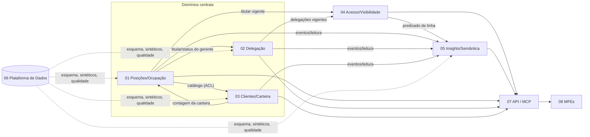
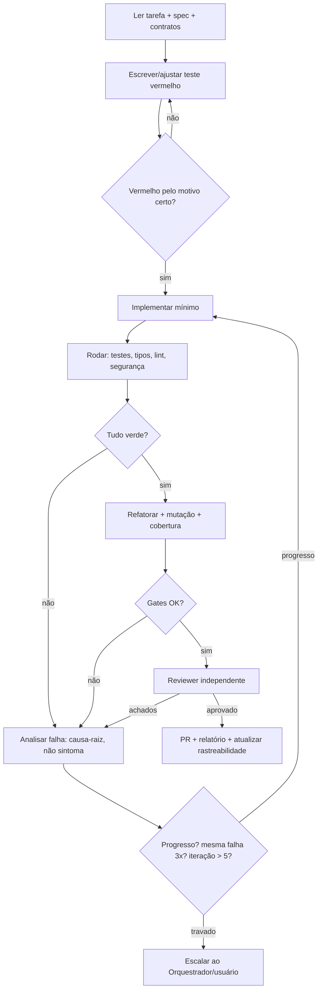

# 00 — Plano de Consolidação: Gestão de Carteira Bancária

> Documento-mestre. Organiza os 8 domínios, a ordem de entrega e a **forma de trabalhar** (Spec-Driven Development, TDD, subagentes, agent looping, anti-"AI slop").
> Fonte dos requisitos: [../Plano Geral.md](../Plano%20Geral.md). System Design: **em aberto** → [system-design/99-system-design-pendente.md](system-design/99-system-design-pendente.md).
> Natureza do projeto: **POC** que valida *tabelas, campos, relacionamentos, camada semântica e esforço de engenharia de dados*, com front para validar jornadas junto a gestor comercial; futura produtificação via API e MCP.

## Sumário
1. Visão e escopo · 2. Constituição do projeto · 3. Domínios e mapa de contexto · 4. Arquitetura de referência · 5. Ondas de entrega · 6. Estratégia de subagentes · 7. Desenvolvimento orientado a testes · 8. Agent looping · 9. Anti AI-slop · 10. Definition of Ready/Done · 11. Rastreabilidade · 12. Achados no Plano Geral · 13. Riscos · 14. Pendências do usuário · 15. Glossário · 16. Referências

---

## 1. Visão e escopo
**Problema:** o banco contratará 5 gerentes de conta e precisa de uma base para **gestão de carteira por posição** (cadeira/mesa), com segmentação, delegação temporária e visão consolidada para o Gerente Geral.
**Princípio central:** **o cliente pertence à Posição, não à pessoa.** Trocar o gerente não migra dados.
**Resultados esperados do planejamento:** (a) modelo de dados/dicionário defensável para dimensionar a engenharia de dados; (b) jornadas J1/J2/J3 demonstráveis; (c) contratos REST/MCP; (d) trilha de desenvolvimento profissional e auditável.
**Fora de escopo (POC):** IdM/perfis reais (usa papel simulado), integração com sistemas legados, dados reais, remuneração variável (citada como motivação de governança, não como requisito).

## 2. Constituição do projeto (herdada por todos os domínios)
| # | Princípio | Consequência verificável |
|---|---|---|
| C1 | **Posição ≠ Pessoa**: nenhum atributo de pessoa em cliente/carteira | Teste cross-domínio AC-CLI-09 / AC-POS-01 |
| C2 | **Nenhum código sem requisito rastreável e sem teste vermelho antes** | Gate de CI: todo commit referencia `FR-*` e vem com teste |
| C3 | **Especificar antes de implementar** (SDD); ambiguidade vira `[NEEDS CLARIFICATION]`, nunca suposição silenciosa | Zero NC abertos para a onda em execução |
| C4 | **Tempo é dependência**: `Clock` injetável; nada de `now()` direto no domínio | Lint/grep no CI |
| C5 | **Estados derivados não se persistem** (situação de delegação, "titular atual") | Revisão de esquema (06) |
| C6 | **Um único ponto de decisão de acesso** (04) e **uma única definição de métrica** (05) | Greps de regra duplicada |
| C7 | **Negar por padrão; auditar o que importa** | Testes de negação; `log_auditoria` |
| C8 | **Dado sintético, coerente e reproduzível**; nada de dado real | Hash do dataset (06) |
| C9 | **Contratos primeiro** (OpenAPI/MCP/eventos) e testados (Pact) | Falha de CI em quebra de contrato |
| C10 | **Decisões em ADR**; stack só após o System Design | `99` + ADRs |
| C11 | **Dinheiro em decimal exato**; datas ISO/fuso America/Sao_Paulo | Testes de propriedade |
| C13 | **Regras visuais são contrato**: tokens vêm do DESIGN-stripe.md (gerados, não copiados); componentes via shadcn/ui; lacunas e conflitos viram decisão explícita (nada inventado) | Varreduras de [system-design/01-design-system-shadcn-stripe.md](system-design/01-design-system-shadcn-stripe.md) §8 |
| C12 | **Simplicidade**: sem abstração especulativa; cada porta/camada justificada por um requisito ou atributo de qualidade | Revisão por reviewer independente |

## 3. Domínios e mapa de contexto
| # | Domínio (bounded context) | Dono dos dados | Plano |
|---|---|---|---|
| 01 | Posições e Ocupação | Posição, Gerente, Ocupação | [dominios/01](dominios/01-dominio-posicoes-ocupacao.md) |
| 02 | Delegação Temporária | Delegação | [dominios/02](dominios/02-dominio-delegacao.md) |
| 03 | Clientes e Carteira | Cliente, Vínculo, Movimentação, Produtos, CRM | [dominios/03](dominios/03-dominio-clientes-carteira.md) |
| 04 | Acesso e Visibilidade | Decisão/auditoria de acesso (sem dados mestres) | [dominios/04](dominios/04-dominio-acesso-visibilidade.md) |
| 05 | Insights, 360° e Torre de Controle | Read models / métricas | [dominios/05](dominios/05-dominio-insights-360-cockpit.md) |
| 06 | Plataforma de Dados | Modelo, dicionário, sintéticos, qualidade | [dominios/06](dominios/06-dominio-plataforma-dados.md) |
| 07 | Integração API/MCP | Contratos (sem dados mestres) | [dominios/07](dominios/07-dominio-integracao-api-mcp.md) |
| 08 | Experiência / Micro-frontends | Shell, tokens, roteiro de demo | [dominios/08](dominios/08-dominio-experiencia-frontend.md) |


**Relações (DDD):** 01 é *Open Host Service* para 02/03/04; 03 consome 01 via **ACL** (`PosicaoCatalogo`); 04 é *conformist-free*: apenas consome portas de 01/02; 05 é *downstream* (CQRS leve); 07 é fachada sem regra; 06 é transversal (plataforma).
**Dependência circular a evitar:** 01↔03 (01 pergunta a contagem; 03 consulta o catálogo) — resolvida por **portas de consulta** sem posse compartilhada de agregado.

## 4. Arquitetura de referência (sem fixar System Design)
- **DDD** (contextos, agregados, linguagem ubíqua) + **Hexagonal** (portas/adaptadores) + **CQRS leve** + **eventos de domínio** (AsyncAPI).
- **Alvo:** serviço e micro-frontend **por bounded context**. **Etapa inicial recomendada:** monolito modular com fronteiras de módulo reais (sem acesso cruzado a tabelas), permitindo extração posterior — **decisão final em D-01 do System Design**.
- **Documentação:** C4 (Contexto/Contêineres/Componentes), arc42 como casca, ADRs, *quality attribute scenarios* (estilo ATAM), checklist **Well-Architected**.
- **Vocabulário bancário:** BIAN para nomear *service domains*.
- **Build/ops:** 12-factor, API-first, *expand/contract* para migração de dados.
- **Skills locais úteis na execução:** `c4-modeler`, `adr-writer`, `quality-attribute-scenario-writer`, `component-boundary-reviewer`, `service-decomposition-advisor`, `monolith-vs-modular-monolith-reviewer`, `test-driven-development`, `code-review-and-quality`, `security-and-hardening`, `impeccable`.

## 5. Ondas de entrega
| Onda | Conteúdo | Pode rodar em paralelo | Portão de saída |
|---|---|---|---|
| **0 Fundação** | Constituição (§2) ratificada; convenções e esquema (06: T-DAD-01..03); gerador sintético base (T-DAD-04); esqueleto de CI com gates (§7, §9); resolução dos NC bloqueantes | 06 ‖ configuração de CI | Dicionário + esquema + dataset base reproduzível; CI vermelho→verde em exemplo |
| **1 Núcleo de dados e titularidade** | 01 e 03 | **01 ‖ 03** | AC-POS-* e AC-CLI-* verdes; teste cross-domínio C1 |
| **2 Regras temporais e acesso** | 02 e 04 | **02 ‖ 04** (04 usa fakes de 01/02 até ficarem prontos) | AC-DEL-*, AC-ACE-* verdes; property-based de 04 |
| **3 Leitura e integração** | 05 e 07 | **05 ‖ 07** | AC-INS-*, AC-API-* verdes; Pact verde; equivalência REST×MCP |
| **4 Experiência** | 08 (já iniciado com mocks desde a onda 1 via contrato) | MFEs em paralelo | E2E J1/J2/J3 verdes; demo ≤ 10 min |
| **5 Endurecimento** | Segurança, desempenho, mutação, revisão final, pacote de apresentação | — | DoD global (§10) |
> Dependências com **System Design**: ondas 0–1 não dependem dele (portas + adaptadores em memória); a partir da onda 2, decisões D-02/D-04/D-05 precisam estar ratificadas ou há retrabalho conhecido nos adaptadores (não nos núcleos).

## 6. Estratégia de subagentes
**Princípio:** um subagente por **bounded context**, contexto mínimo e artefatos como contrato de passagem de bastão (spec, contrato, testes). Os subagentes **não conversam livremente entre si**; coordenam-se por arquivos versionados.

### 6.1 Papéis
| Papel | Responsabilidade | Entrada | Saída | Pode escrever em |
|---|---|---|---|---|
| **Orquestrador** (sessão principal) | Sequenciar ondas, resolver conflitos, manter 00 | Todos os planos | Decisões, merges | `planos/` |
| **Spec Writer** | Refinar spec/clarify de um domínio | Domínio + Plano Geral | Spec revisada, NC | arquivo do domínio |
| **Domain Modeler** | Agregados, invariantes, eventos | Spec | Modelo + testes de invariante (vermelhos) | `src/<domínio>/domain` |
| **Test Author** | Testes de aceite 1:1 dos G/W/T + property-based | Spec | Suíte vermelha | `tests/<domínio>` |
| **Implementer** | Fazer a suíte passar com o mínimo | Testes vermelhos | Código | `src/<domínio>` |
| **Data/Semantic Engineer** | Esquema, sintéticos, modelo semântico | 06, 05 | DDL, seeds, cubos | `data/`, `semantic/` |
| **API/MCP Engineer** | Contratos e adaptadores | 07 | OpenAPI, MCP | `contracts/`, `adapters/` |
| **UI Engineer** | MFEs e shell | 08 + contratos | MFEs | `frontend/` |
| **Reviewer (independente)** | Revisão em 2 eixos: *spec compliance* → *qualidade* | Diff + spec | Parecer com achados | — (somente leitura) |
| **Security Reviewer** | Ameaças (acesso, PII, prompt injection) | Diff + 04/07 | Achados | — |
| **Spec Analyzer** | Consistência spec↔plano↔tasks↔testes | Todos os planos | Relatório de lacunas | — |

### 6.2 Regras
1. **Dono único por pasta/arquivo** por onda (evita conflito de merge). Cada subagente roda em **worktree/branch isolada**; integra por PR pequeno.
2. **Quem implementa não revisa**: o Reviewer é uma instância separada com contexto limpo (evita viés de confirmação).
3. **Contexto mínimo**: o prompt de cada subagente contém só (a) a constituição §2, (b) o arquivo do domínio, (c) contratos de vizinhos, (d) a tarefa `T-XXX-nn` e seu critério de aceite. Nunca o histórico de conversa.
4. **Handoff por artefato**: o resultado é um diff + relatório estruturado (o que mudou, testes que provam, requisitos cobertos, dúvidas). Texto livre sem artefato não vale como entrega.
5. **Paralelismo seguro**: só tarefas marcadas `[P]` e sem dependência de contrato não publicado. Dependência de vizinho → usa **fake do contrato** até o real existir.
6. **Escalonamento**: ambiguidade de requisito, conflito de contrato ou 3 falhas iguais seguidas → para e devolve ao Orquestrador/usuário com a pergunta objetiva.
7. **Revisão final por outro modelo/instância** em cada onda (ver §9).

### 6.3 Modelo de tarefa entregue a um subagente
```
TAREFA: T-<DOM>-<nn>   ONDA: <n>   REQUISITOS: FR-..., AC-...
CONTEXTO: constituição (§2), domínio, contratos vizinhos (links)
FAÇA: <escopo mínimo>      NÃO FAÇA: <fora de escopo, arquivos proibidos>
CRITÉRIO DE ACEITE: testes <ids> verdes + gates (§7) + sem NC aberto
SAÍDA: PR + relatório (cobertura de FR, testes novos, riscos, dúvidas)
LIMITES: máx. 5 iterações do loop (§8); escalar após 3 falhas iguais
```

## 7. Desenvolvimento orientado a testes (TDD)
**Regra de ouro (C2):** *red → green → refactor*; todo código de produção nasce para fazer passar um teste que **falhou antes pelo motivo certo**.

| Camada | O que testa | Técnica | Gate |
|---|---|---|---|
| Unitário de domínio | Invariantes (01–04), funções puras (`vigente`, `decidir`) | Exemplos + **property-based** (geradores de históricos aleatórios com oráculo ingênuo independente) | Cobertura de ramos do núcleo ≥ 90% |
| Aceitação | Cada Given/When/Then (`AC-*`) | Teste 1:1 nomeado pelo ID | 100% dos AC da onda |
| Contrato | OpenAPI/MCP/eventos | **Pact** + lint de contrato | 0 quebras |
| Integração | Adaptadores com banco real (não mocks do que se quer provar) | Contêiner efêmero / suíte de contrato de repositório | Verde |
| Dados | Esquema, sintéticos, qualidade | Suíte de contrato de dados (06) | 0 violações |
| E2E | J1, J2, J3 pelo front | Playwright + axe | Verde |
| Mutação | A suíte detecta defeitos? | Mutation testing nos núcleos 01–04 | Escore ≥ 80% (meta; ajustável por ADR) |
| Adversarial | Prompt injection, acesso indevido | Suíte dedicada (07/04) | 0 falhas |

**Práticas obrigatórias:** relógio injetável e *time-travel* em testes; fixtures nomeadas por cenário (J1/J2/J3); **testes não verificam mocks**: só fronteiras externas são simuladas; um teste vermelho deve falhar por asserção, não por erro de compilação/setup; **teste de regressão para todo bug**.
**Ordem em cada tarefa:** (1) escrever AC como teste → (2) ver falhar → (3) implementar mínimo → (4) ver passar → (5) refatorar com a suíte verde → (6) rodar gates.
**Spec como teste:** o checklist de cada domínio funciona como "testes unitários da especificação" (requisito mensurável, sem ambiguidade, rastreável).

## 8. Agent looping
Loop fechado e **com saída objetiva**, por tarefa:


**Critérios de saída (todos):** AC da tarefa verdes; suíte completa verde; tipos/lint/segurança limpos; cobertura e mutação nos limites; reviewer sem achado bloqueante; rastreabilidade atualizada.
**Salvaguardas:** limite de iterações (padrão 5); detecção de **não-progresso** (mesmo erro 3×) e de **oscilação** (alterna entre dois estados); proibido "corrigir" **enfraquecendo o teste**, apagando asserção, silenciando erro ou adicionando `skip`; mudança de teste existente exige justificativa ligada ao requisito; **estado por tarefa** persistido em arquivo (`.agent/estado/T-XXX.md`: tentativa, hipótese, resultado) para retomar sem repetir erros; *checkpoint* por onda (tag + relatório). Diagnóstico estruturado de falhas persistentes via skill `diagnosing-bugs`.
**Loops secundários:** *Spec Loop* (Spec Analyzer ↔ Spec Writer até 0 lacunas); *Data Loop* (gerar → validar qualidade → ajustar semente/regras); *Review Loop* (Reviewer ↔ Implementer, máx. 3 rodadas).

## 9. Anti AI-slop
**Definição de trabalho:** "slop" = saída plausível mas **não fundamentada** (alucinada, genérica, redundante, ou que não prova o que alega).

### 9.1 Referências de mercado (links verificados em 2026-10-01)
| Referência | Uso no projeto | Link |
|---|---|---|
| **GitHub Spec Kit** | Fluxo SDD: constitution → specify → clarify → plan → tasks → implement; checklist de qualidade de requisitos | https://github.com/github/spec-kit |
| **obra/superpowers** | Metodologia para agentes: TDD (red-green-refactor), verificação antes de concluir, desenvolvimento por subagentes com revisão em dois estágios (conformidade com spec, depois qualidade) | https://github.com/obra/superpowers |
| Skills locais: `test-driven-development`, `code-review-and-quality`, `security-and-hardening`, `impeccable` (UI) | Execução dos gates | (instaladas no ambiente) |
| OpenFGA · Permify · Cube · Twenty (citados no Plano Geral) | Avaliação, **não adoção automática** | https://github.com/openfga/openfga · https://github.com/Permify/permify · https://github.com/cube-js/cube · https://github.com/twentyhq/twenty |
| BIAN | Vocabulário de domínios bancários | https://bian.org |
> Ferramentas complementares (a escolher no System Design, pesquisar na versão atual antes de adotar): mutation testing (ex.: Stryker/mutmut/PIT), análise estática (ex.: Semgrep, SonarQube), verificação de dependências (ex.: auditoria de pacotes e lockfile), Pact, Spectral (lint OpenAPI), axe/Playwright.
> *Notas de verificação:* Permify consta como agora parte da FusionAuth e sob AGPL-3.0 (impacto de licença a avaliar); as capacidades de OpenFGA para condições/tempo e do Cube para segurança em nível de linha **não foram confirmadas** nas fontes lidas — validar em spike antes de qualquer decisão.

### 9.2 Barreiras (gates) contra slop
| Risco de slop | Barreira |
|---|---|
| Requisito inventado | Todo código rastreável a `FR-*`; **ambiguidade vira NC**, não suposição (C3) |
| Biblioteca/API alucinada | Dependência nova exige verificação no registro oficial + versão fixada em lockfile + ADR se estrutural (*slopsquatting*) |
| Teste que não prova nada | Mutação ≥ meta; revisão de asserções; proibido assert trivial; teste vermelho obrigatório antes |
| Mock que testa o mock | Só se simula fronteira externa; integração com BD real |
| "Funciona na minha máquina" | Verificação antes de afirmar conclusão: comando, saída e commit registrados no relatório |
| Abstração especulativa / código morto | C12 + detector de código não referenciado + reviewer |
| Comentários óbvios e prosa genérica | Revisão: comentário só explica *por quê*; docs com exemplos executáveis |
| Dados fictícios incoerentes | Dataset determinístico + testes de soma/integridade (06) |
| UI genérica / desvio do design | Checklist de UI (08) + crítica via `impeccable`; textos reais pt-BR; **varreduras de tokens, pill, peso, raio, `tnum` e contraste** (01-design-system §8) |
| Segurança superficial | Revisão de ameaças (04/07), suíte adversarial, sem PII em log/URL |
| Auto-aprovação | **Reviewer ≠ Implementer**; revisão final por instância/modelo diferente |
| Deriva de escopo | PRs pequenos; Spec Analyzer a cada onda; mudança de requisito = mudança de spec primeiro |

### 9.3 Lista de anti-padrões proibidos
Teste sem asserção · `skip`/`xfail` sem ticket · captura de exceção que engole erro · `now()` direto no domínio · float para dinheiro · regra de acesso fora de 04 · métrica calculada fora de 05 · string livre onde há `ref_*` · atributo de pessoa em cliente · texto de CRM tratado como instrução · "TODO" sem requisito · README promissor sem execução comprovada.

## 10. Definition of Ready / Done
**Ready (para iniciar uma tarefa):** FR/AC definidos; NC relevantes resolvidos; contratos de vizinhos disponíveis (real ou fake); critério de aceite testável; dono único; limite do loop definido.
**Done (tarefa):** AC verdes; suíte completa verde; gates (cobertura, mutação, tipos, lint, segurança) verdes; revisão independente aprovada; rastreabilidade atualizada; documentação mínima (por quê, não o quê) atualizada; sem NC aberto.
**Done (onda):** portão de saída da §5 + relatório do Spec Analyzer sem lacunas + demonstração do cenário correspondente.
**Done (projeto/POC):** J1, J2, J3 demonstráveis em ≤ 10 min com dataset reproduzível; dicionário de dados completo; contratos REST/MCP publicados; ADRs do System Design aplicados; risco residual documentado.

## 11. Matriz de rastreabilidade (R → FR → AC)
| Req. | Descrição | FR principais | AC principais |
|---|---|---|---|
| R1 | Posição, não pessoa | FR-POS-001/008, FR-CLI-002/003 | AC-POS-01, AC-CLI-09 |
| R2 | Gerentes e ocupação | FR-POS-004..009 | AC-POS-01..06 |
| R3 | Delegação | FR-DEL-001..011 | AC-DEL-01..10 |
| R4 | Clientes e segmentação | FR-CLI-001..005 | AC-CLI-01, 06 |
| R5 | Visibilidade e papel simulado | FR-ACE-001..012, FR-UX-001/002 | AC-ACE-01..11, AC-UX-04 |
| R6 | Visões 360°, carteira, Torre | FR-INS-001..010, FR-UX-005..007 | AC-INS-01..08, AC-UX-02/03 |
| R7 | Redistribuição + auditoria | FR-CLI-006..010, FR-DAD-007 | AC-CLI-02..08 |
| R8 | Jornadas J1/J2/J3 + fluxo executivo | FR-UX-013, AC dos domínios | AC-POS-01, AC-DEL-01/02, AC-INS-01/02, AC-UX-01..03 |
| R9 | REST + MCP | FR-API-001..012 | AC-API-01..08 |
| R10 | Dados: modelo, semântica, sintéticos, migração | FR-DAD-001..015, FR-INS-001 | AC-DAD-01..08 |
> A matriz é mantida pelo Spec Analyzer: cada FR deve apontar para ≥ 1 AC e ≥ 1 teste; cada AC para ≥ 1 teste automatizado.

## 12. Achados no Plano Geral (inconsistências e lacunas a tratar)
1. **Estado persistido que deveria ser derivado:** `status` da ocupação ("Titular Atual") e `status = 'Em Vigor'` da delegação duplicam informação temporal → risco de divergência. *(C5; 01/02/06)*
2. **`dim_gerentes.status = Férias`** duplica delegação/afastamento.
3. **`id_agencia` sem tabela** (`dim_agencias` inexistente).
4. **`score_credito` × `score_risco`:** nomes diferentes para possível mesmo conceito.
5. **Histórico de carteira ausente:** `id_posicao_carteira` direto não guarda histórico (necessário para auditoria e *as-of*).
6. **Auditoria:** exigida (R7) mas sem tabela no DDL.
7. **Delegação "entre posições ou entre gerentes"** (texto inicial) × DDL (origem=posição, delegado=gerente).
8. **API insegura:** `user_email` e `role_override` em query string (PII em log; ator forjável).
9. **Aprovação da delegação** (`Submetida/Aprovada GG/Revogada`) existe no modelo de benchmark, mas o DDL final não a inclui (`status` = Em Vigor…).
10. **Fronteiras temporais indefinidas:** timestamp × dia, inclusividade e fuso.
11. **Produtos e CRM** (360°) citados no protótipo, mas sem tabelas.
12. **Limiares de desbalanceamento** apenas exemplificados (120%/40%).
13. **Posição de "Gerente Geral":** não é titular de posição; seu papel não está modelado (perfil em `dim_gerentes` + regra em 04).
14. **Ferramenta MCP `simulate_reallocation`** citada na stack, ausente da lista final de ferramentas.
15. **Benchmarks citados** (BIAN, FSC, OpenFGA, Permify, Cube, Twenty) vêm do material anterior; esta consolidação **verificou apenas o que o README/página de cada repositório confirma** (§9.1).
> Cada item tem tratamento em um domínio (veja os `NC-*`) — nenhum foi "resolvido" silenciosamente.

## 13. Riscos
| Risco | Prob. | Impacto | Mitigação | Domínio |
|---|---|---|---|---|
| System Design chega e contradiz decisões-padrão | M | M | Portas/adaptadores; 99 com D-01…D-14 | todos |
| Sheets sem ACID inviabiliza redistribuição atômica | A | M | Atomicidade na aplicação + validação; produção em SQL | 03/06 |
| Sobreposição de ocupações/delegações em motor sem constraint | M | A | Invariante no agregado + teste de qualidade periódico | 01/02/06 |
| Vazamento por agregação (métricas) | M | A | `PredicadoDeLinha` na semântica + testes de equivalência | 04/05 |
| *Prompt injection* via notas CRM no MCP | M | A | Tratar como dado; suíte adversarial; confirmação humana em escrita | 07 |
| Spike de OpenFGA/Cube inconclusivo | M | B | Núcleo próprio como padrão (D) | 04/05 |
| Escopo do front crescer (demo vira produto) | A | M | 08 limitado a J1–J3; tokens; sem lógica no front | 08 |
| Dados sintéticos pouco realistas enfraquecem a validação | M | M | Distribuições calibradas + revisão do gestor | 06 |
| Metas de mutação/cobertura irreais | B | B | Ajuste via ADR com evidência | todos |
| Identidade visual indefinida atrasa 08 | A | B | Tokens neutros; T-UX-11 depende do usuário | 08 |

## 14. Pendências do usuário
> **Atualização:** as perguntas de negócio foram respondidas ou resolvidas por padrão de POC — ver [perguntas-em-aberto.md](perguntas-em-aberto.md) (origens **[U]** usuário / **[P]** padrão de POC). A tabela "NC prioritários" abaixo está **resolvida**; o System Design geral (D-01…D-14) também foi **decidido** — ver [system-design/03-decisoes-system-design-poc.md](system-design/03-decisoes-system-design-poc.md). **Nada impede o início do desenvolvimento, exceto a sua liberação explícita.**
1. **Fornecer o `.md` de System Design** (salvar em `planos\system-design\`).
2. Responder os `[NEEDS CLARIFICATION]` P1 por domínio (consolidados abaixo).
3. ~~Definir identidade visual~~ — **fechado** (DESIGN-stripe.md + shadcn/ui).
4. Confirmar a escolha dos limiares de mutação/cobertura (§7) ou aceitar os padrões.

**NC prioritários (bloqueiam a onda indicada):**
| NC | Pergunta | Bloqueia |
|---|---|---|
| NC-POS-1 | Gerente em mais de uma posição? | Onda 1 |
| NC-POS-5 / NC-DEL-5 | Data (dia) ou timestamp? Inclusividade e fuso | Onda 1–2 |
| NC-CLI-2 | Capacidade: alerta ou bloqueio? | Onda 1 |
| NC-DEL-2 | Titular ausente: bloqueado ou leitura? | Onda 2 |
| NC-DEL-3 / NC-CLI-1 | Quem solicita/aprova delegação; quem redistribui | Onda 2 |
| NC-ACE-1/3 | Escopo de escrita do GG; "Apenas Emergencial" | Onda 2 |
| NC-INS-1 | Limiares de desbalanceamento | Onda 3 |
| ~~NC-UX-2~~, ~~NC-DS-1..8~~ | **Fechados** (app independente; cromo escuro; malha só na capa; semânticos; Inter; React/TS/Tailwind; regra de contraste) — ver 01-design-system §9 | — |

## 15. Glossário
**Posição:** cadeira/mesa perene que detém a carteira · **Titular/Ocupação:** pessoa que ocupa a posição num intervalo · **Delegação:** cobertura temporária de uma posição por outro gerente · **Carteira:** clientes vinculados a uma posição · **Vigência:** intervalo em que algo produz efeito · **As-of:** consulta ao estado numa data · **ReBAC/ABAC/RLS:** controle de acesso por relacionamento/atributo/linha · **Camada semântica:** definição única de métricas e dimensões · **MFE:** micro-frontend · **MCP:** Model Context Protocol · **SDD:** Spec-Driven Development · **NC:** `[NEEDS CLARIFICATION]`.

## 16. Referências
- [Plano Geral.md](../Plano%20Geral.md) (fonte dos requisitos).
- GitHub Spec Kit — https://github.com/github/spec-kit
- obra/superpowers — https://github.com/obra/superpowers
- OpenFGA — https://github.com/openfga/openfga · Permify — https://github.com/Permify/permify · Cube — https://github.com/cube-js/cube · Twenty — https://github.com/twentyhq/twenty
- BIAN — https://bian.org
- Planos de domínio: `dominios/01…08` · System Design: `system-design/99-…`

## 17. Changelog
| Data | Mudança |
|---|---|
| 2026-10-01 | Criação inicial: 00 + 8 domínios + 99 (System Design pendente). |
| 2026-10-01 | Recebido insumo de System Design: **shadcn/ui + DESIGN-stripe.md** como design system do cockpit. Novo [system-design/01-design-system-shadcn-stripe.md](system-design/01-design-system-shadcn-stripe.md); atualizados 99 (D-10 parcial, D-15), 08 (§2.5, FR-UX-015..020, AC-UX-08..11) e este 00 (C13, §9). Nenhum código desenvolvido. |
| 2026-10-01 | Ambiente Google verificado e documentado em [system-design/02-ambiente-google-sheets-apps-script.md](system-design/02-ambiente-google-sheets-apps-script.md): Apps Script lido e escrito via clasp; projeto GCP `gestao-carteira-poc` e service account criados; planilha compartilhada pelo usuário e leitura/escrita comprovadas via service account (ENV-1/2); web app do Apps Script fica sem implantação, publicação manual pelo usuário (ENV-3). |
| 2026-10-01 | Repositório GitHub informado: https://github.com/brunotrolo/GestaoCarteiraBancaria (público, `main` com só `README.md`). Registrado em 03-decisoes; nenhum `init`/*push* feito. Cuidados de publicação (Infos.md, scriptId, Plano Geral) listados lá. |
| 2026-10-01 | **System Design D-01…D-14 decididos** (recomendações adotadas pelo usuário) em [system-design/03-decisoes-system-design-poc.md](system-design/03-decisoes-system-design-poc.md); 99 atualizado. Restam ações do usuário: billing GCP (só ao publicar), repositório remoto e liberação para iniciar o desenvolvimento. |
| 2026-10-01 | **Perguntas de negócio respondidas/fechadas** em [perguntas-em-aberto.md](perguntas-em-aberto.md): uma posição por gerente (nova FR-POS-012/AC-POS-07), datas inclusivas, titular ausente só leitura, alerta de capacidade com justificativa, CPF/CNPJ sempre mascarados com "revelar" auditado, logs sem expurgo; demais por padrão de POC. Domínios 01–08 atualizados na seção Clarify. Ondas 1–3 sem bloqueios de negócio; resta System Design (D-01…D-14). |
| 2026-10-01 | **Pendências de design removidas:** NC-DS-1..8, NC-UX-2 e NC-UX-3 fechados com decisões em 01-design-system §9; 08 e 99 alinhados. Resta apenas o `.md` geral de System Design (D-01…D-14). |
