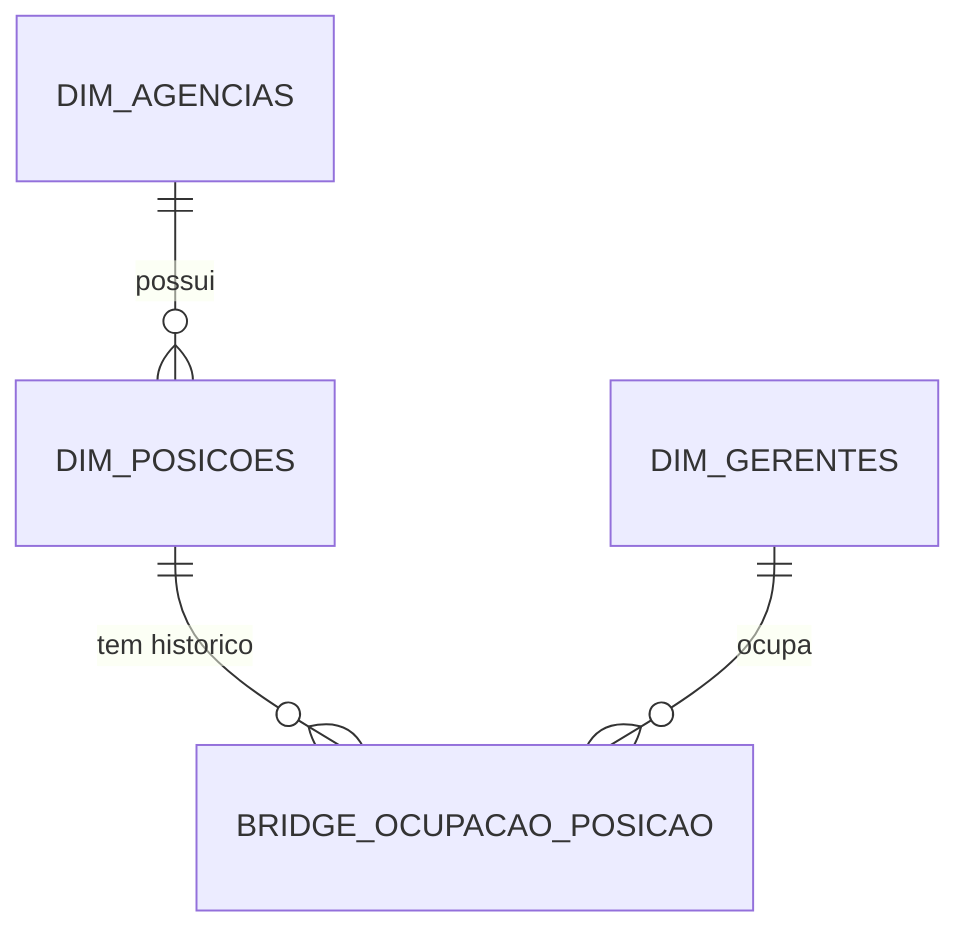

# 01 — Domínio: Posições e Ocupação (Estrutura Organizacional)

> Fase SDD: Specify → Clarify → Plan → Tasks → Checklist. Princípios herdados de [../00-consolidacao.md](../00-consolidacao.md) §2 (Constituição).
> Requisitos cobertos: R1, R2, R8-J1. Onda de entrega: **1** (paralelo com 03).

## 1. Propósito e fronteiras
**Propósito:** manter o cadastro perene das **Posições** (cadeiras/mesas), das **Pessoas** (gerentes) e o **histórico de titularidade** (quem ocupa qual posição e quando). É a âncora da regra "carteira pertence à posição, nunca à pessoa".

**Dentro do escopo:** ciclo de vida da Posição; cadastro de Gerente; Ocupação (titularidade) e sua troca; consulta "quem era titular da posição P na data D".
**Fora do escopo:** clientes e carteira (→ 03); delegação temporária (→ 02); decisão de acesso (→ 04); autenticação real (→ System Design).
**Linguagem ubíqua:** Posição, Titular, Ocupação, Vacância, Interino, Agência.
**Referência BIAN (nomenclatura):** *Human Resources / Resource Allocation*-like (a validar em `99`).

## 2. Specify

### 2.1 User stories
| ID | Prioridade | História |
|---|---|---|
| US-POS-1 | P1 | Como Gerente Geral, quero cadastrar posições com segmento-alvo e capacidade para estruturar a agência. |
| US-POS-2 | P1 | Como Gerente Geral, quero trocar o titular de uma posição sem alterar nenhum cliente (**J1 Turnover sem atrito**). |
| US-POS-3 | P1 | Como Gerente Geral, quero ver o histórico de titulares de uma posição para auditoria. |
| US-POS-4 | P2 | Como Gerente Geral, quero congelar/extinguir uma posição preservando sua história. |
| US-POS-5 | P2 | Como Gerente Geral, quero designar titular interino/trainee durante vacância. |

### 2.2 Requisitos funcionais
| ID | Requisito |
|---|---|
| FR-POS-001 | A Posição possui identificador **perene e opaco** (ex.: `POS-AG01-001`), nome, `id_agencia`, `segmento_especialidade` (Private, Alta Renda, Middle Market, Misto/Geral), `capacidade_max_contas` (> 0) e `status` ∈ {Ativa, Congelada, Extinta}. |
| FR-POS-002 | Transições de status permitidas: Ativa→Congelada, Congelada→Ativa, Ativa/Congelada→Extinta. Extinta é terminal. |
| FR-POS-003 | **Extinguir** exige carteira vazia (0 clientes vinculados) — validação consome contrato do domínio 03. |
| FR-POS-004 | O Gerente possui `id_gerente` (matrícula), nome, `email_corporativo` **único** (case-insensitive), `perfil` ∈ {Gerente de Contas, Gerente Adjunto, Gerente Geral} e `status` ∈ {Ativo, Afastado, Desligado}. |
| FR-POS-005 | A Ocupação liga Gerente↔Posição com `data_inicio`, `data_fim` (nula = vigente) e `tipo_vinculo` ∈ {Titular Efetivo, Trainee, Interino}. |
| FR-POS-006 | **Invariante:** no máximo **uma** ocupação vigente por posição em qualquer instante; intervalos de uma mesma posição nunca se sobrepõem. |
| FR-POS-007 | Vacância é permitida (intervalo sem ocupação). Posição vaga **mantém** sua carteira íntegra. |
| FR-POS-008 | **Trocar titular** é operação atômica: encerra a ocupação vigente (`data_fim`) e cria a nova. Não emite nem exige nenhuma escrita em clientes. |
| FR-POS-009 | Consulta temporal *as-of*: titular de uma posição em data D; posições de um gerente em data D. |
| FR-POS-010 | Gerente com status Desligado/Afastado não pode receber nova ocupação; desligar o titular vigente sem substituto deixa a posição em vacância (evento `PosicaoVagou`). |
| FR-POS-011 | Eventos de domínio publicados: `PosicaoCriada`, `PosicaoStatusAlterado`, `TitularAlterado`, `PosicaoVagou`. |
| FR-POS-012 | **Decisão Q-01:** um gerente tem **no máximo uma** ocupação vigente em todo o sistema (e a posição, no máximo um titular). Alocar gerente já titular de outra posição exige encerrar antes a ocupação anterior. |

### 2.3 Cenários de aceite (Given/When/Then)
- **AC-POS-01 (J1)** — *Dado* a POS-03 com titular A e 70 clientes; *quando* o Gerente Geral troca o titular para B com início na segunda; *então* a ocupação de A recebe `data_fim` = véspera de B, B é titular vigente, e a contagem e o conteúdo dos 70 clientes permanecem idênticos (comparação por hash do conjunto de `id_cliente`).
- **AC-POS-02** — *Dado* POS-01 com titular vigente; *quando* se tenta criar segunda ocupação vigente; *então* rejeita com erro `OCUPACAO_SOBREPOSTA`.
- **AC-POS-03** — *Dado* POS com carteira ≠ vazia; *quando* tenta extinguir; *então* rejeita `POSICAO_COM_CARTEIRA`.
- **AC-POS-04** — *Dado* troca de titular com `data_inicio` anterior ao fim da ocupação anterior; *então* rejeita `INTERVALO_INVALIDO`.
- **AC-POS-05** — *Dado* histórico com A (jan–jun) e B (jul–): *quando* consulta *as-of* 15/03 *então* A; 15/08 *então* B; posição inexistente *então* 404 de domínio.
- **AC-POS-06** — *Dado* gerente Desligado; *quando* tentam alocá-lo; *então* `GERENTE_INDISPONIVEL`.
- **AC-POS-07 (Q-01)** — *Dado* gerente A titular vigente da POS-01; *quando* tentam torná-lo titular da POS-02 sem encerrar a ocupação anterior; *então* rejeita `GERENTE_JA_ALOCADO`.

### 2.4 Casos de borda
Troca no mesmo dia (início = fim anterior + 1 dia, sem lacuna nem sobreposição); retroatividade (permitida? ver Clarify); gerente em duas posições; e-mail com caixa diferente; fuso horário (America/Sao_Paulo).

## 3. Clarify (`[NEEDS CLARIFICATION]`)
> **Resolvidas** (ver [../perguntas-em-aberto.md](../perguntas-em-aberto.md)): NC-POS-1 → uma posição por gerente (FR-POS-012) · NC-POS-2 → retroativo só pelo GG com motivo · NC-POS-3 e 4 → derivar estados e remover "Férias" · NC-POS-5 → datas inclusivas, America/Sao_Paulo · NC-POS-6 → criar `dim_agencias`. O texto abaixo é o histórico das perguntas.
1. `[NC-POS-1]` Um gerente pode ocupar **mais de uma posição** simultaneamente? (O Plano Geral não proíbe; o protótipo assume 1:1.) *Recomendação:* permitir no modelo, restringir por política configurável.
2. `[NC-POS-2]` Retroatividade: pode-se registrar troca com `data_inicio` no passado? Quem aprova?
3. `[NC-POS-3]` `status` de ocupação ("Titular Atual/Encerrado") é **derivável** de `data_fim` — o Plano Geral o armazena. *Recomendação:* **derivar**, não armazenar (evita estado inconsistente).
4. `[NC-POS-4]` `dim_gerentes.status = Férias` duplica a informação de Delegação. *Recomendação:* remover "Férias" do status e derivar de 02.
5. `[NC-POS-5]` Granularidade temporal: data (dia) ou timestamp? *Recomendação:* **data**, intervalo fechado, fuso America/Sao_Paulo.
6. `[NC-POS-6]` `id_agencia` aparece sem tabela de agências no Plano Geral — criar `dim_agencias` (→ 06)?

## 4. Plan

### 4.1 Modelo do domínio
- **Agregado `Posicao`** (raiz): invariantes FR-POS-001/002/003.
- **Agregado `Gerente`**: FR-POS-004.
- **Agregado `HistoricoTitularidade`** (por posição): contém `Ocupacao[]`; protege FR-POS-006/007/008 (a invariante de não-sobreposição exige que as ocupações vivam no **mesmo agregado**).
- **Serviço de domínio** `TrocarTitular(posicao, gerente, inicio, tipo)`.
- **Relógio** injetável (`Clock` port) — nunca `now()` direto.

(Esquema físico canônico em [06](06-dominio-plataforma-dados.md).)

### 4.2 Portas e contratos
- **Publica (Open Host Service):** `GET posicoes`, `GET posicoes/{id}/titular?asof=`, `POST posicoes/{id}/titular`, eventos acima.
- **Consome:** `ContarClientesDaPosicao(id)` de 03 (para FR-POS-003).
- **Quem consome este domínio:** 02 (valida delegado), 04 (resolve titularidade), 05 (nome de posição/gerente).

### 4.3 Quality attribute scenarios
| Atributo | Cenário | Medida |
|---|---|---|
| Integridade | Duas trocas concorrentes na mesma posição | Exatamente uma vence; a outra falha com conflito (lock otimista/versão) |
| Auditabilidade | Qualquer troca | 100% geram registro com ator, instante e motivo |
| Desempenho | `titular?asof=` | p95 < 200 ms no POC |

### 4.4 Dependências do System Design (→ [99](../system-design/99-system-design-pendente.md))
Persistência (garantia de unicidade/exclusão de sobreposição depende do motor), estratégia de concorrência, broker de eventos, política de autenticação do ator.

## 5. Tasks (TDD — cada tarefa começa por teste vermelho)
| # | Tarefa | Teste-primeiro | Par. |
|---|---|---|---|
| T-POS-01 | Value objects: `IdPosicao`, `Segmento`, `StatusPosicao`, `Email` | Unitário de validação e igualdade | [P] |
| T-POS-02 | Agregado `Posicao` + transições | Tabela de transições (property-based: nenhuma saída de Extinta) | [P] |
| T-POS-03 | Agregado `HistoricoTitularidade` | Property-based: para qualquer sequência de trocas, não há sobreposição e há ≤1 vigente | |
| T-POS-04 | Serviço `TrocarTitular` + `Clock` fake | AC-POS-01/02/04/06 | |
| T-POS-05 | Consulta *as-of* | AC-POS-05 | [P] |
| T-POS-06 | Porta de repositório + adaptador em memória | Suíte de contrato do repositório (reusada no adaptador real) | |
| T-POS-07 | Eventos de domínio + outbox | Teste de publicação única por troca | |
| T-POS-08 | Teste de **invariante cross-domínio** "troca não toca clientes" | AC-POS-01 contra adaptador real de 03 | |
| T-POS-09 | Contrato HTTP (OpenAPI) + Pact provider | Verificação do pact dos consumidores 02/04/08 | |

## 6. Checklist de qualidade da especificação
- [ ] Todo FR possui ≥1 cenário de aceite.
- [ ] Nenhum termo vago ("rápido", "adequado") sem métrica.
- [ ] Todo `[NC-POS-n]` resolvido ou carregado como risco no 00.
- [ ] Nenhuma decisão de stack neste arquivo.
- [ ] Rastreável: R1→FR-POS-001/008; R2→FR-POS-004..009; J1→AC-POS-01.
