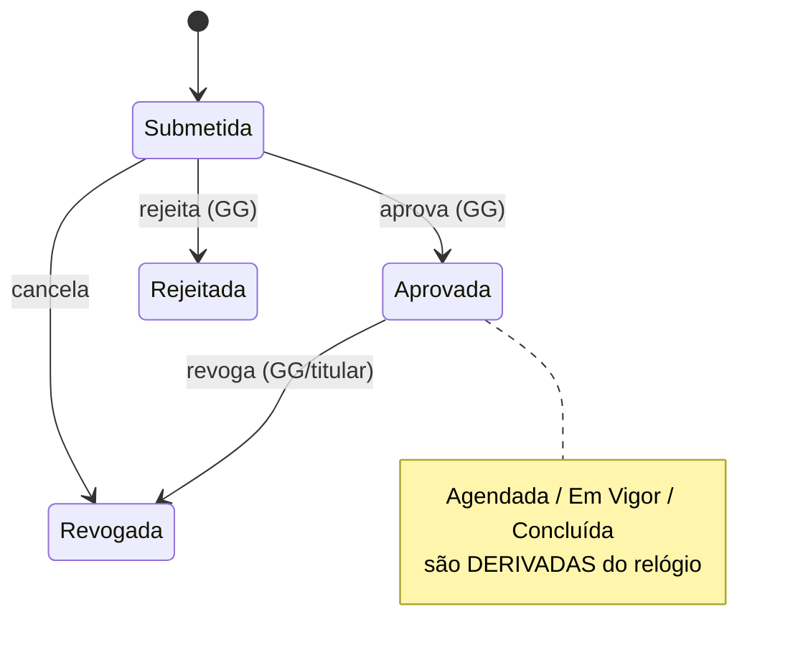

# 02 — Domínio: Delegação Temporária (Gestor Delegado)

> Princípios herdados de [../00-consolidacao.md](../00-consolidacao.md) §2. Requisitos: R3, R8-J2. Onda de entrega: **2** (após 01 e 03).

## 1. Propósito e fronteiras
**Propósito:** conceder a um gerente cobertura temporária de uma posição (férias, licença), entre duas datas, com escopo e aprovação, **sem alterar cadastro de clientes nem titularidade**. Expira automaticamente.

**Dentro:** ciclo de vida da delegação, regras de elegibilidade e sobreposição, vigência, revogação, política do titular ausente.
**Fora:** avaliar quem enxerga o quê em tempo de consulta (→ 04, que *consome* delegações vigentes); troca definitiva de titular (→ 01).
**Linguagem ubíqua:** Delegação, Posição de origem, Delegado, Vigência, Escopo, Cobertura.
**Conceito de mercado:** relação temporal ReBAC — `(Gerente B) —delegado_temporário→ (Posição P) [de X até Y]`.

## 2. Specify

### 2.1 User stories
| ID | Pri. | História |
|---|---|---|
| US-DEL-1 | P1 | Como gerente/GG, quero agendar a cobertura da minha posição entre X e Y para um colega (**J2**). |
| US-DEL-2 | P1 | Como delegado, quero ver "Minha Carteira" e "Carteira Delegada (cobertura temporária)" durante a vigência. |
| US-DEL-3 | P1 | Como GG, quero que a cobertura expire sozinha no dia seguinte a Y, sem TI. |
| US-DEL-4 | P2 | Como GG, quero aprovar ou revogar delegações antes/durante a vigência. |
| US-DEL-5 | P2 | Como GG, quero definir o escopo (Total, Apenas Consulta, Apenas Emergencial). |

### 2.2 Requisitos funcionais
| ID | Requisito |
|---|---|
| FR-DEL-001 | Delegação = `id_delegacao`, `id_posicao_origem`, `id_gerente_delegado`, `data_inicio`, `data_fim`, `motivo`, `escopo` ∈ {Total, Apenas Consulta, Apenas Emergencial}, `status_aprovacao` ∈ {Submetida, Aprovada, Rejeitada, Revogada}, `criada_por`, timestamps. |
| FR-DEL-002 | `data_inicio ≤ data_fim`; vigência em **datas inclusivas** (fuso America/Sao_Paulo): vigente em D ⇔ `inicio ≤ D ≤ fim`. |
| FR-DEL-003 | **A "situação" (Agendada / Em Vigor / Concluída) é derivada** de `status_aprovacao` + relógio; **não é gravada**. Cancelar/revogar é o único estado persistido de encerramento antecipado. |
| FR-DEL-004 | Somente delegações **Aprovadas** produzem efeito de acesso. Aprovação requer perfil Gerente Geral (POC: papel simulado). |
| FR-DEL-005 | Delegado deve ser gerente **Ativo** e diferente do titular vigente da posição de origem (sem auto-delegação). |
| FR-DEL-006 | Não pode haver duas delegações **aprovadas e sobrepostas** para a mesma `posicao_origem` com escopo conflitante. |
| FR-DEL-007 | **Sem transitividade:** o delegado não pode repassar a cobertura recebida. |
| FR-DEL-008 | Durante a vigência, o titular ausente fica **Somente Leitura** ou **Bloqueado** como **Somente Leitura** (decisão Q-08; sem política configurável na POC). |
| FR-DEL-009 | Revogação antecipada encerra o efeito imediatamente (a partir do instante da revogação), preservando o registro. |
| FR-DEL-010 | Delegações nunca são apagadas; histórico consultável *as-of*. |
| FR-DEL-011 | Eventos: `DelegacaoSubmetida`, `DelegacaoAprovada`, `DelegacaoIniciada`, `DelegacaoExpirada`, `DelegacaoRevogada`. `Iniciada/Expirada` são emitidos por varredura agendada, mas **o acesso não depende dela** (a vigência é calculada na consulta). |

### 2.3 Cenários de aceite
- **AC-DEL-01 (J2)** — *Dado* delegação aprovada POS-01→gerente da POS-02 de 01/11 a 15/11; *quando* o delegado consulta em 05/11; *então* vê POS-02 (titular) + POS-01 (delegada, marcada "cobertura temporária").
- **AC-DEL-02** — *Mesmo dado*; *quando* consulta em 16/11 00:00 (America/Sao_Paulo); *então* POS-01 não aparece, sem nenhuma intervenção.
- **AC-DEL-03 (limites)** — consulta em 01/11 e 15/11 → incluída; 31/10 e 16/11 → excluída.
- **AC-DEL-04** — delegação **Submetida** (não aprovada) não concede acesso.
- **AC-DEL-05** — *Dado* sobreposição aprovada para a mesma origem; *então* rejeita `DELEGACAO_SOBREPOSTA`.
- **AC-DEL-06** — delegar para si mesmo → `AUTO_DELEGACAO`; para gerente Desligado → `GERENTE_INDISPONIVEL`.
- **AC-DEL-07** — delegado tenta criar delegação da posição recebida → `DELEGACAO_TRANSITIVA`.
- **AC-DEL-08** — revogação às 10h do dia 05/11 → acesso do delegado cessa a partir de 10h; histórico permanece.
- **AC-DEL-09** — escopo "Apenas Consulta": delegado lê clientes da origem e é **negado** em qualquer escrita (verificado em 04).
- **AC-DEL-10** — troca de titular da origem durante a vigência: delegação **continua** (pertence à posição, não à pessoa).

### 2.4 Casos de borda
Mudança de horário de verão; delegação que cobre a vacância da origem; delegado que deixa de ser Ativo durante a vigência (acesso cessa — evento `DelegadoIndisponivel`); delegação começando no passado; delegação de 1 dia.

## 3. Clarify
> **Resolvidas** (ver [../perguntas-em-aberto.md](../perguntas-em-aberto.md)): NC-DEL-1 → qualquer gerente Ativo · NC-DEL-2 → **titular ausente somente leitura** (FR-DEL-008 sem política configurável) · NC-DEL-3 → solicita titular ou GG, aprova GG, GG pode aprovar as próprias · NC-DEL-4 → sem delegação parcial · NC-DEL-5 → datas inclusivas · NC-DEL-6 → sem notificações na POC. Histórico abaixo.
1. `[NC-DEL-1]` O delegado deve ser **titular de outra posição** ou pode ser qualquer gerente ativo (ex.: Adjunto sem posição)? *Rec.:* qualquer gerente Ativo.
2. `[NC-DEL-2]` Titular ausente: Bloqueado ou Somente Leitura? *Rec.:* política configurável, padrão Somente Leitura.
3. `[NC-DEL-3]` Quem pode solicitar e quem aprova? (O Plano Geral cita "Aprovada Gerente Geral".) Auto-aprovação pelo GG permitida?
4. `[NC-DEL-4]` Delegação parcial (subconjunto de clientes/segmento) está no escopo? *Rec.:* **não** na POC.
5. `[NC-DEL-5]` Datas ou timestamps? (Plano mistura `TIMESTAMP` com "dia 16/11".) *Rec.:* datas inclusivas.
6. `[NC-DEL-6]` Notificações ao delegado/titular — canal e necessidade (fora da POC?).

## 4. Plan

### 4.1 Modelo
- **Agregado `Delegacao`** + máquina de estados de aprovação.
- **Política `ElegibilidadeDelegado`** (consulta 01: gerente Ativo, titular vigente).
- **Política `SobreposicaoDelegacao`** (consulta delegações aprovadas da mesma origem).
- **Função pura** `vigente(delegacao, instante)` e `situacao(delegacao, instante)` — testada em isolamento, usada por 04 via contrato.

### 4.2 Contratos
- **Publica:** `POST /delegacoes`, `POST /delegacoes/{id}/aprovacao`, `POST /delegacoes/{id}/revogacao`, `GET /delegacoes?posicao=&asof=`, **consulta `DelegacoesVigentes(instante)`** (consumida por 04), eventos.
- **Consome:** 01 (titular, status do gerente).
- **Pact:** 04 e 08 são consumidores.

### 4.3 Quality attribute scenarios
| Atributo | Cenário | Medida |
|---|---|---|
| Corretude temporal | Consulta exatamente em `data_fim` e `fim+1` | 100% dos limites cobertos por teste parametrizado |
| Robustez | Job de varredura falha ou atrasa | Acesso continua correto (vigência calculada, não materializada) |
| Auditabilidade | Aprovar/revogar | Ator + instante + motivo registrados |

### 4.4 Dependências do System Design
Agendador (varredura de eventos), mecanismo de notificação, modelo de identidade para "aprovador".

## 5. Tasks
| # | Tarefa | Teste-primeiro | Par. |
|---|---|---|---|
| T-DEL-01 | `vigente()` / `situacao()` puras | Tabela de limites + property-based (monotonicidade no tempo) + fuso/horário de verão | [P] |
| T-DEL-02 | Agregado e máquina de estados | Transições válidas/ inválidas | [P] |
| T-DEL-03 | Política de elegibilidade | AC-DEL-06/07 | |
| T-DEL-04 | Política de sobreposição | AC-DEL-05 (property-based: nenhum par aprovado sobreposto) | |
| T-DEL-05 | Casos de uso: submeter, aprovar, rejeitar, revogar | AC-DEL-04/08 | |
| T-DEL-06 | Consulta `DelegacoesVigentes` | AC-DEL-01/02/03 | |
| T-DEL-07 | Varredura + eventos Iniciada/Expirada (idempotente) | Executar 2× não duplica evento | |
| T-DEL-08 | Cenário cross-domínio com 01 (AC-DEL-10) e 04 (AC-DEL-09) | Teste de integração | |
| T-DEL-09 | Pact provider + OpenAPI | Verificação de contrato | |

## 6. Checklist
- [ ] Nenhum campo de situação persistido além de `status_aprovacao` e revogação.
- [ ] Todo limite de data coberto (início, fim, véspera, dia seguinte).
- [ ] NC-DEL-1..6 resolvidos/registrados no 00.
- [ ] Rastreável: R3→FR-DEL-001..011; J2→AC-DEL-01/02.
