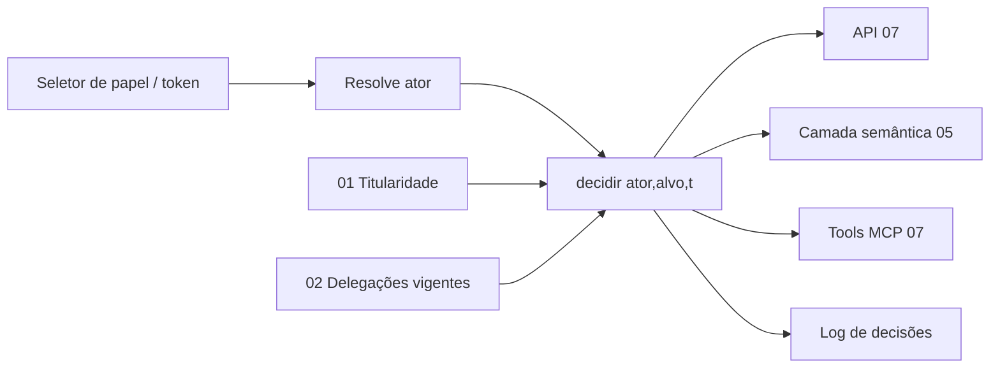

# 04 — Domínio: Acesso e Visibilidade (Motor de Regras)

> Princípios herdados de [../00-consolidacao.md](../00-consolidacao.md) §2. Requisitos: R5. Onda de entrega: **2**.

## 1. Propósito e fronteiras
**Propósito:** decidir, para um **ator** e um **instante**, quais clientes/posições ele pode ver e com que modo (escrita, leitura, negado). Oferece **um único ponto de decisão** reutilizado por API, camada semântica, MCP e front.

**Dentro:** função de decisão `Acesso(ator, cliente|posição, instante)`; papel simulado da POC; modos de acesso; auditoria de decisões relevantes; estratégia de *enforcement*.
**Fora:** autenticação/identidade real (POC não tem IdM — decisão do usuário; produção → System Design); regras de negócio de delegação (→ 02) e titularidade (→ 01), apenas consumidas.
**Linguagem ubíqua:** Ator, Papel simulado, Modo de acesso, Origem do acesso (Titular/Delegado/Gerente Geral), Instante de avaliação.

## 2. Specify

### 2.1 User stories
| ID | Pri. | História |
|---|---|---|
| US-ACE-1 | P1 | Como gerente, vejo estritamente os clientes da minha posição (e de delegações vigentes). |
| US-ACE-2 | P1 | Como Gerente Geral, vejo tudo (visão agência). |
| US-ACE-3 | P1 | Como apresentador da POC, troco o papel no topo (Posição 1–5 / Gerente Geral) para demonstrar. |
| US-ACE-4 | P2 | Como auditor, consulto "quem tinha acesso ao cliente C em D e por quê". |

### 2.2 Requisitos funcionais
| ID | Requisito |
|---|---|
| FR-ACE-001 | **Regra central:** `Acesso(G,C) ⇔ C.posição = PosiçãoTitular(G, t) ∨ ∃ D ∈ DelegaçõesVigentes(G, t) : C.posição = D.posição_origem`. |
| FR-ACE-002 | O **Gerente Geral** tem acesso de leitura a todas as posições e clientes; escrita limitada às operações administrativas (trocar titular, aprovar delegação, redistribuir). |
| FR-ACE-003 | **Negação por padrão:** ator sem relação ⇒ conjunto vazio; ator desconhecido/inativo ⇒ negado. |
| FR-ACE-004 | A decisão devolve `{permitido, modo, origem, motivo}`; modo ∈ {Escrita, Leitura, Negado}. `origem` ∈ {Titular, Delegado, GerenteGeral}. |
| FR-ACE-005 | O **modo** da delegação segue o `escopo` de 02: Total→Escrita; Apenas Consulta→Leitura; Apenas Emergencial→Leitura + ações emergenciais listadas (NC-ACE-3). |
| FR-ACE-006 | Titular com posição sob delegação vigente fica em **Somente Leitura** (decisão Q-08). |
| FR-ACE-007 | Quando um ator tem acesso por mais de uma origem ao mesmo cliente, prevalece o **modo mais permissivo**; ambas as origens são reportadas. |
| FR-ACE-008 | A avaliação aceita um **instante explícito** (consulta *as-of*) e usa o `Clock` injetável. |
| FR-ACE-009 | **Papel simulado (POC):** o ator é informado explicitamente pelo cliente (seletor), identificado por posição ou "GG"; o sistema o resolve para o titular vigente daquela posição. Controlado por *feature flag* `SIMULACAO_PAPEL`; **desligado ⇒ ator vem do contexto autenticado**. |
| FR-ACE-010 | Toda resposta em modo simulado carrega marcador (`X-Modo-Simulacao: true`) e o front exibe banner permanente. |
| FR-ACE-011 | O mesmo resultado de decisão é aplicado em **todos** os pontos de entrada (API, MCP, camada semântica). Nenhum ponto implementa regra própria. |
| FR-ACE-012 | Decisões negadas e acessos via delegação/GG são registrados (ator, alvo, instante, origem, resultado). |

### 2.3 Cenários de aceite
- **AC-ACE-01** — titular da POS-02 consulta → só clientes da POS-02.
- **AC-ACE-02 (J2)** — delegação aprovada vigente POS-01→gerente POS-02 → vê POS-02 ∪ POS-01; fora da vigência → só POS-02.
- **AC-ACE-03** — delegação **não aprovada** ou **revogada** → sem acesso adicional.
- **AC-ACE-04** — GG → todas as 5 posições; contagens somam o total da agência.
- **AC-ACE-05** — ator desconhecido → vazio (não erro de vazamento de existência).
- **AC-ACE-06 (J1)** — após troca de titular, o **novo** titular tem acesso imediato e o antigo perde (sem alterar clientes).
- **AC-ACE-07** — escopo "Apenas Consulta": leitura permitida, escrita negada (`modo=Leitura`).
- **AC-ACE-08** — titular ausente sob política Somente Leitura → lê, não escreve.
- **AC-ACE-09** — simulação desligada e cabeçalho de papel enviado → **ignorado/rejeitado**.
- **AC-ACE-10** — *as-of* 31/10 vs 05/11 reproduz exatamente as visibilidades da época (usa histórico de 01/02/03).
- **AC-ACE-11** — posição vaga: nenhum gerente acessa por titularidade; GG sim; delegação de posição vaga é possível.

### 2.4 Casos de borda
Gerente titular de 2 posições; delegado que também é titular da origem; delegação e GG simultâneos; fuso/horário de verão; relógio exatamente no limite.

## 3. Clarify
> **Resolvidas** (ver [../perguntas-em-aberto.md](../perguntas-em-aberto.md)): NC-ACE-1 → GG escreve só trocar titular, aprovar/revogar delegação e redistribuir · NC-ACE-2 → sem Adjunto · NC-ACE-3 → Emergencial = leitura + nota de atendimento · NC-ACE-4 → **CPF/CNPJ sempre mascarados**; "revelar" auditado (titular e GG) · NC-ACE-5 → **logs registrados, sem política de expurgo** (decisão de POC). Com Q-01, o caso de borda "gerente titular de 2 posições" deixa de existir. Histórico abaixo.
1. `[NC-ACE-1]` GG escreve em quê além de operações administrativas (ex.: editar cliente)?
2. `[NC-ACE-2]` Existe "Gerente Adjunto" com visão de uma posição sem ser titular? (perfil citado em 01.)
3. `[NC-ACE-3]` O que é exatamente "Apenas Emergencial" (lista de ações permitidas)?
4. `[NC-ACE-4]` Mascaramento de PII por papel/modo (ex.: delegado em modo leitura vê CPF?).
5. `[NC-ACE-5]` Retenção de logs de decisão (prazo regulatório).

## 4. Plan

### 4.1 Modelo e estratégia
- **Núcleo puro e determinístico:** `decidir(ator, alvo, instante, snapshotRelações) → Decisão`. Sem I/O; as relações (titularidade, delegações vigentes) entram por **portas** que 01 e 02 implementam.
- **Porta `PoliticaDeAcesso`** com implementações trocáveis. Opções avaliadas (decisão final no System Design — ver `99`):

| Opção | Descrição | Prós | Contras |
|---|---|---|---|
| A. View/RLS no banco (SQL) | A regra do Plano Geral como view/política de linha | Simples, baixo custo POC, auditável | Acopla regra ao motor de BD; Sheets não tem RLS |
| B. ReBAC dedicado — **OpenFGA** | Tuplas `delegado_temporario` com condições temporais | Modelo expressivo, padrão Zanzibar | Novo componente; validar suporte a condições/tempo (spike) |
| C. ReBAC dedicado — **Permify** | Idem | Suporta RBAC/ReBAC/ABAC | Licença AGPL-3.0 e projeto agora parte da FusionAuth — avaliar implicações |
| D. Biblioteca embutida | Núcleo puro (este domínio) + adaptador | Zero infraestrutura, testável | Reimplementa o motor |

**Recomendação de partida:** D (núcleo puro) com adaptador A; manter a porta estável para o spike B/C quando o System Design decidir.

- **Enforcement em profundidade:** (1) filtro na camada de aplicação/API, (2) RLS ou view no armazenamento, (3) *security context* na camada semântica (05), (4) mesma decisão nas ferramentas MCP (07).

### 4.2 Contratos
- **Publica:** `Decidir(ator, alvo, instante)`, `PosicoesPermitidas(ator, instante)`, `PredicadoDeLinha(ator, instante)` (para filtro/RLS/semântica), `GET /acesso/explicacao?cliente=&asof=`.
- **Consome:** 01 `TitularVigente(posição, t)`, 02 `DelegacoesVigentes(t)`.

### 4.3 Quality attribute scenarios
| Atributo | Cenário | Medida |
|---|---|---|
| Segurança | Ator sem relação consulta qualquer cliente | 0 linhas retornadas em 100% dos testes propriedade |
| Consistência | Mesma pergunta via API, semântica e MCP | Resultados idênticos (teste de equivalência) |
| Desempenho | Resolver posições de 1 ator | p95 < 50 ms (POC, 5 posições) |
| Rastreabilidade | Pergunta "por que X viu C" | Explicação completa (origem + delegação) |

### 4.4 Dependências do System Design
Autenticação real, token/claims do ator, escolha A/B/C/D, local de *enforcement* final, política de logs.

## 5. Tasks
| # | Tarefa | Teste-primeiro | Par. |
|---|---|---|---|
| T-ACE-01 | Tipos `Ator`, `Decisão`, `Modo`, `Origem` | Unitário | [P] |
| T-ACE-02 | Núcleo `decidir` (titular) | AC-ACE-01/05/06/11 | |
| T-ACE-03 | Delegação no núcleo (modo/escopo) | AC-ACE-02/03/07/08 | |
| T-ACE-04 | Gerente Geral | AC-ACE-04 | [P] |
| T-ACE-05 | **Property-based:** "não existe cliente visível sem relação válida"; monotonicidade temporal | Geradores de históricos aleatórios, oráculo independente (implementação ingênua) | |
| T-ACE-06 | Papel simulado + feature flag + marcador | AC-ACE-09 | |
| T-ACE-07 | `PredicadoDeLinha` (A) + teste de equivalência com o núcleo | Para toda combinação gerada: SQL ≡ núcleo | |
| T-ACE-08 | Consulta as-of + explicação | AC-ACE-10 | |
| T-ACE-09 | Log de decisões | Teste de conteúdo/ PII ausente | [P] |
| T-ACE-10 | Spike OpenFGA/Permify (time-boxed 1 dia) | ADR com resultado e testes de equivalência | opcional |

## 6. Checklist
- [ ] Núcleo sem dependência de I/O nem de `now()`.
- [ ] Nenhum outro módulo contém regra de visibilidade (grep).
- [ ] Modo simulado impossível de ligar por acidente em produção (teste de configuração).
- [ ] NC-ACE-1..5 resolvidos/registrados no 00.
- [ ] Rastreável: R5→FR-ACE-001..012; J1/J2→AC-ACE-06/02.
