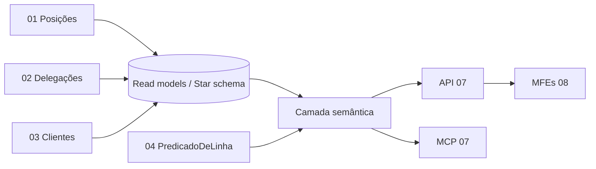

# 05 — Domínio: Insights, Visão 360° e Torre de Controle (Camada Semântica)

> Princípios herdados de [../00-consolidacao.md](../00-consolidacao.md) §2. Requisitos: R6, R8-J3, R10 (camada semântica). Onda de entrega: **3**.

## 1. Propósito e fronteiras
**Propósito:** fornecer leituras agregadas e detalhadas — **Visão 360° do cliente**, **Visão da carteira** e **Torre de Controle do Gerente Geral** — por meio de uma **camada semântica** com métricas definidas uma única vez e consumida por front, API e MCP.

**Dentro:** catálogo de métricas e dimensões, definições formais, *security context* herdado de 04, visões 360/carteira/cockpit, indicadores de desbalanceamento.
**Fora:** escrita (→ 01/02/03); decisão de acesso (→ 04, aqui apenas aplicada).
**Linguagem ubíqua:** Métrica, Dimensão, Cubo, Grão, Utilização, Desbalanceamento, Penetração.
**Candidato de mercado:** **Cube** (camada semântica open source com SQL/REST/GraphQL; README também cita integração MCP). *Validar em spike:* aplicação de regras de acesso por contexto de segurança e compatibilidade com a fonte escolhida em `99`.

## 2. Specify

### 2.1 User stories
| ID | Pri. | História |
|---|---|---|
| US-INS-1 | P1 | Como gerente, vejo a visão da minha carteira (clientes, AUM, segmentos, capacidade). |
| US-INS-2 | P1 | Como gerente, abro a **visão 360°** de um cliente (cadastro, risco, produtos, CRM, histórico de posições). |
| US-INS-3 | P1 | Como GG, vejo a **Torre de Controle** consolidada da agência (**J3**). |
| US-INS-4 | P1 | Como GG, identifico desbalanceamento de capacidade entre posições. |
| US-INS-5 | P2 | Como delegado, vejo "Minha Carteira" e "Carteira Delegada" separadas, com marcação de cobertura. |
| US-INS-6 | P2 | Como analista, consulto métricas *as-of* uma data. |

### 2.2 Catálogo de métricas (definição formal)
| Métrica | Definição | Grão / filtros |
|---|---|---|
| `total_clientes` | Contagem de clientes com status Ativo | posição, segmento, agência |
| `aum_total` | Soma de `volume_aum` de clientes Ativos | idem |
| `aum_medio_por_cliente` | `aum_total / total_clientes` (0 se denominador 0) | idem |
| `utilizacao_capacidade` | `total_clientes / capacidade_max_contas` | posição |
| `desbalanceamento` | Posição com `utilizacao` fora de [limite_inferior, limite_superior] (padrão do Plano Geral: ex. 120% e 40% — **limiares a confirmar**) | posição |
| `penetracao_produto` | `clientes com produto P ativo / total_clientes` | posição, segmento, produto |
| `penetracao_media` | Média das penetrações do catálogo de produtos | posição |
| `volumetria_por_segmento` | Contagem e AUM por segmento | agência, posição |
| `movimentacoes_periodo` | Contagem de movimentações de carteira no período | posição origem/destino |

> Toda métrica nova exige: definição, grão, tratamento de nulos/zero, teste de valor esperado com dados sintéticos controlados.

### 2.3 Requisitos funcionais
| ID | Requisito |
|---|---|
| FR-INS-001 | Métricas e dimensões são definidas **em um único lugar** (modelo semântico versionado); front, API e MCP não recalculam. |
| FR-INS-002 | Toda consulta recebe o **contexto de segurança** (ator + instante) e aplica o `PredicadoDeLinha` de 04; resultados agregados nunca incluem clientes fora da visibilidade. |
| FR-INS-003 | **Visão 360° do cliente:** cadastro, segmento, AUM, renda, score, posição atual, data de carteirização, linha do tempo de posições, produtos (penetração), notas CRM — respeitando mascaramento (NC-INS-4). |
| FR-INS-004 | **Visão da carteira:** clientes, AUM, distribuição por segmento, utilização de capacidade, clientes sem produto-chave. |
| FR-INS-005 | **Torre de Controle (GG):** AUM total, nº de clientes, penetração média, volumetria por segmento, utilização por posição, lista de desbalanceamentos. |
| FR-INS-006 | Visão do delegado separa carteira própria e delegada, e marca origem/vigência da cobertura. |
| FR-INS-007 | Parâmetro `asof` reproduz a visão numa data passada (usa históricos de 01/02/03). |
| FR-INS-008 | Cada resposta carrega **carimbo de atualização** (frescor do dado). |
| FR-INS-009 | Saída de totais é consistente: soma das posições = total da agência (invariante testada). |
| FR-INS-010 | Linguagem executiva: nomes de métricas em pt-BR, com descrição em linguagem de negócio (para o gestor comercial). |

### 2.4 Cenários de aceite
- **AC-INS-01 (J3)** — dados sintéticos controlados (5 posições, totais conhecidos) → Torre mostra exatamente `aum_total`, `total_clientes` e utilização esperados.
- **AC-INS-02** — POS-01 com 120% e POS-04 com 40% → ambas aparecem em `desbalanceamento`; POS-02 a 85% não.
- **AC-INS-03** — gerente da POS-02 consultando `total_clientes` por posição → só vê a própria (e delegadas vigentes); nunca a soma da agência.
- **AC-INS-04** — GG: soma por posição = total da agência (FR-INS-009).
- **AC-INS-05** — 360° de cliente de outra posição, sem relação → negado/inexistente.
- **AC-INS-06** — *as-of* anterior à redistribuição reproduz a carteira antiga.
- **AC-INS-07** — carteira vazia: métricas 0, sem divisão por zero.
- **AC-INS-08** — delegado em 05/11 vê duas seções; em 16/11 só a própria.

## 3. Clarify
> **Resolvidas** (ver [../perguntas-em-aberto.md](../perguntas-em-aberto.md)): NC-INS-1 → desbalanceamento acima de **100%** ou abaixo de **50%** por posição (120%/40% = massa de teste) · NC-INS-2 → catálogo de produtos de NC-CLI-7 · NC-INS-3 → tempo real sobre sintéticos · NC-INS-4 → CPF/CNPJ sempre mascarados · NC-INS-5 → só os KPIs listados · NC-INS-6 → sem metas. Histórico abaixo.
1. `[NC-INS-1]` Limiares de desbalanceamento (superior/inferior) e se são por posição ou globais.
2. `[NC-INS-2]` Catálogo oficial de produtos para a penetração.
3. `[NC-INS-3]` Frescor exigido: tempo real, diário? (POC: tempo real sobre dados sintéticos.)
4. `[NC-INS-4]` Mascaramento de PII no 360° por papel.
5. `[NC-INS-5]` Definição de "saúde comercial" (a Torre promete essa leitura, mas não há KPI definido além dos listados).
6. `[NC-INS-6]` Metas/orçado por posição existem? (permitiria atingimento; não consta no Plano Geral.)

## 4. Plan

### 4.1 Modelo analítico
- **Padrão estrela** sobre o modelo transacional de 06: fatos `fct_carteira_diaria` (snapshot por posição/segmento/dia), `fct_produtos_cliente`, `fct_movimentacao_carteira`, `fct_delegacoes`; dimensões `dim_posicoes`, `dim_gerentes`, `dim_clientes`, `dim_segmentos`, `dim_produtos`, `dim_tempo`.
- **Cubos:** Carteira, Cliente360, Capacidade, Movimentação, Cobertura.
- **CQRS leve:** escrita nos domínios 01–03; leitura aqui (read models). Atualização por eventos ou *refresh* agendado (decisão em `99`).

### 4.2 Contratos
- **Publica:** `GET insights/agencia`, `GET insights/posicoes/{id}`, `GET clientes/{id}/visao-360`, `GET insights/desbalanceamento`, todos com `asof`; esquema de métricas versionado.
- **Consome:** 04 (predicado), 01/02/03 (eventos/leitura).

### 4.3 Quality attribute scenarios
| Atributo | Cenário | Medida |
|---|---|---|
| Segurança | Consulta agregada por gerente comum | 0 vazamento por agregação (teste: total do gerente = soma de seus clientes visíveis) |
| Consistência | Mesma métrica em API, MCP e front | Valores idênticos |
| Desempenho (POC) | Torre com ~350 clientes | < 1 s |
| Governança | Mudança de definição de métrica | Versionada + teste de regressão de valor |

### 4.4 Dependências do System Design
Escolha do motor analítico (BigQuery vs Postgres), Cube ou alternativa, estratégia de atualização, cache.

## 5. Tasks
| # | Tarefa | Teste-primeiro | Par. |
|---|---|---|---|
| T-INS-01 | Dataset sintético **controlado** com respostas calculadas à mão (fixtures J3) | Planilha de verdade-terrestre revisada por humano | |
| T-INS-02 | Modelo semântico: `total_clientes`, `aum_total`, `aum_medio` | AC-INS-01/07 | [P] |
| T-INS-03 | `utilizacao_capacidade`, `desbalanceamento` | AC-INS-02 | [P] |
| T-INS-04 | Penetração de produtos | Valores esperados do dataset | [P] |
| T-INS-05 | Aplicar `PredicadoDeLinha` no contexto de segurança | AC-INS-03/05; teste de equivalência com 04 | |
| T-INS-06 | Invariante soma das partes = total | AC-INS-04 (property-based) | |
| T-INS-07 | Visão 360° (read model) | AC-INS-05/06 | |
| T-INS-08 | Visão do delegado | AC-INS-08 | |
| T-INS-09 | *As-of* | AC-INS-06 | |
| T-INS-10 | Spike Cube (time-boxed) + ADR | Matriz de decisão com critérios; teste de RLS | opcional |
| T-INS-11 | Pact provider + OpenAPI | Verificação | |

## 6. Checklist
- [ ] Nenhuma métrica calculada fora do modelo semântico.
- [ ] Toda métrica com definição, grão, tratamento de nulos e teste.
- [ ] Fixtures com valores esperados independentes da implementação.
- [ ] NC-INS-1..6 resolvidos/registrados no 00.
- [ ] Rastreável: R6→FR-INS-003..006; J3→AC-INS-01/02.
