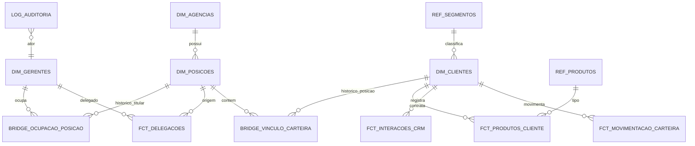

# 06 — Domínio: Plataforma de Dados (Modelo, Dados Sintéticos, Migração, Qualidade)

> Princípios herdados de [../00-consolidacao.md](../00-consolidacao.md) §2. Requisitos: R10 e suporte a todos os demais. Onda de entrega: **0 (fundação)**, evolui junto das demais.
> Foco declarado do projeto: **modelagem de dados, camada semântica e engenharia de dados são o centro**; o front valida jornadas.

## 1. Propósito e fronteiras
**Propósito:** ser a fonte canônica do **modelo lógico**, do **dicionário de dados**, dos **dados sintéticos coerentes** (que sustentam POC, testes e demonstração), da **estratégia de migração Sheets → armazenamento definitivo** e da **qualidade/linhagem** dos dados.

**Dentro:** modelo lógico e regras de integridade; dicionário; convenções (chaves, tipos, datas, dinheiro); geração de dados sintéticos determinísticos; carga idempotente; testes de qualidade; linhagem; matriz de portabilidade (Sheets / Cloud SQL / BigQuery).
**Fora:** regras de negócio (cada domínio é dono); escolha final do armazenamento (→ System Design).
**Linguagem ubíqua:** Dimensão, Fato, Bridge, SCD2, Chave natural/substituta, Seed, Cenário.

## 2. Specify

### 2.1 User stories
| ID | Pri. | História |
|---|---|---|
| US-DAD-1 | P1 | Como líder do projeto, quero ver todas as tabelas, campos e relacionamentos documentados para dimensionar o esforço de engenharia de dados. |
| US-DAD-2 | P1 | Como time, quero dados sintéticos coerentes e reproduzíveis cobrindo J1, J2 e J3. |
| US-DAD-3 | P1 | Como time, quero um esquema portável para Sheets (POC) e SQL (produção). |
| US-DAD-4 | P2 | Como engenheiro, quero testes de qualidade de dados automáticos. |
| US-DAD-5 | P2 | Como auditor, quero linhagem e retenção definidas. |

### 2.2 Requisitos funcionais
| ID | Requisito |
|---|---|
| FR-DAD-001 | Existe **um modelo lógico único** (ER + dicionário campo a campo: tipo, nulabilidade, domínio de valores, regra, dono do domínio). |
| FR-DAD-002 | Convenções: dinheiro em **decimal exato** (nunca float); datas em ISO 8601; fuso America/Sao_Paulo; `snake_case`; prefixos `dim_`, `fct_`, `bridge_`, `ref_`, `log_`. |
| FR-DAD-003 | Chaves **opacas e perenes** (não derivadas de nome, CPF ou e-mail). |
| FR-DAD-004 | Estados **derivados** não são persistidos (situação de delegação, "Titular Atual") — ver NC-DAD-2. |
| FR-DAD-005 | Tabelas de referência (`ref_segmentos`, `ref_status_*`, `ref_produtos`, `ref_escopo_delegacao`) em vez de strings livres. |
| FR-DAD-006 | Tabela `dim_agencias` criada (o Plano Geral referencia `id_agencia` sem defini-la). |
| FR-DAD-007 | `log_auditoria` append-only: ator, ação, entidade, antes/depois, instante, correlação. |
| FR-DAD-008 | Geração de **dados sintéticos determinísticos** (semente fixa) com cenários nomeados: base (≈ 5 posições / ≈ 350 clientes), **J1** (troca de titular), **J2** (cobertura 01/11–15/11), **J3** (desbalanceamento 120%/40%). |
| FR-DAD-009 | Dados sintéticos **inequivocamente fictícios**: nomes gerados, CPF/CNPJ com dígitos válidos mas de faixa marcada como sintética; nenhum dado real; AUM com distribuição realista por segmento (assimétrica). |
| FR-DAD-010 | Carga **idempotente**: reexecutar não duplica; resultado reproduzível (hash do conjunto). |
| FR-DAD-011 | Regras de integridade referencial e de domínio **testadas** independentemente do motor (suíte de contrato de dados). |
| FR-DAD-012 | Regras não expressáveis no motor (ex.: não sobreposição de ocupações no BigQuery/Sheets) são garantidas na **aplicação** e verificadas por teste de qualidade periódico. |
| FR-DAD-013 | Linhagem documentada: fonte → tabela → read model → métrica. |
| FR-DAD-014 | Matriz de portabilidade descreve o que cada alvo suporta (constraints, transações, RLS, tipos). |
| FR-DAD-015 | Política LGPD: classificação de campos (PII), mascaramento, retenção, minimização. |

### 2.3 Cenários de aceite
- **AC-DAD-01** — gerar a base duas vezes com a mesma semente → hash idêntico.
- **AC-DAD-02** — 0 violações de FK/unicidade/domínio na base sintética.
- **AC-DAD-03** — cenário J2 produz exatamente uma delegação aprovada POS-01→gerente da POS-02, 01/11–15/11.
- **AC-DAD-04** — cenário J3: POS-01 a 120% e POS-04 a 40% de utilização.
- **AC-DAD-05** — carga repetida não altera contagens.
- **AC-DAD-06** — teste de qualidade detecta ocupação sobreposta injetada propositalmente.
- **AC-DAD-07** — nenhum CPF/CNPJ do dataset passa em checagem contra faixa real (marcador sintético presente).
- **AC-DAD-08** — documento de dicionário cobre 100% das colunas existentes (teste que compara esquema × dicionário).

## 3. Clarify
> **Resolvidas** (ver [../perguntas-em-aberto.md](../perguntas-em-aberto.md)): NC-DAD-2 → derivar estados · NC-DAD-3 → **log de auditoria sem expurgo** na POC · NC-DAD-4 → modelar `id_agencia`, operar uma · NC-DAD-5 → ≈ 350 clientes, seed fixa · NC-DAD-6 → catálogo de NC-CLI-7. **Segue aberta:** NC-DAD-1 (armazenamento de produção → System Design).
1. `[NC-DAD-1]` Armazenamento-alvo de produção: Cloud SQL (ACID) vs BigQuery (analítico) vs ambos (OLTP + analítico)? → **System Design**.
2. `[NC-DAD-2]` Persistir ou derivar estados? *Rec.:* derivar (ver 01/02).
3. `[NC-DAD-3]` Janela de retenção de histórico e log de auditoria.
4. `[NC-DAD-4]` Gestão de múltiplas agências no futuro (a POC tem 1)?
5. `[NC-DAD-5]` Volume previsto (clientes/posições/lotes) para dimensionar.
6. `[NC-DAD-6]` O catálogo de produtos reais do banco está disponível?

## 4. Plan

### 4.1 Modelo lógico-alvo (consolidado dos domínios)

Mapeamento com o Plano Geral: `dim_posicoes`, `dim_gerentes`, `bridge_ocupacao_posicao`, `fct_delegacoes`, `dim_clientes` (+ `id_posicao_carteira` como **projeção do vínculo vigente** em `bridge_vinculo_carteira`). **Novos:** `dim_agencias`, `bridge_vinculo_carteira`, `fct_movimentacao_carteira`, `fct_produtos_cliente`, `fct_interacoes_crm`, `log_auditoria`, `ref_*`, `fct_carteira_diaria` (read model, domínio 05).

### 4.2 Dicionário de dados
Mantido em `planos/dominios/anexos/dicionario-de-dados.md` (a criar na execução de T-DAD-02), um bloco por tabela, com colunas: campo · tipo lógico · nulável · domínio · regra · dono · classificação LGPD · origem no Plano Geral (ou "novo").

### 4.3 Ajustes ao modelo do Plano Geral (decisões propostas, a ratificar)
| Item do Plano Geral | Problema | Proposta |
|---|---|---|
| `status` em ocupação ("Titular Atual/Encerrado") | Redundante com `data_fim` | Derivar |
| `fct_delegacoes.status = 'Em Vigor'` filtrado na view junto com datas | Pode divergir do relógio; requer job | Derivar situação; persistir só aprovação/revogação |
| `dim_gerentes.status = Férias` | Duplica delegação/afastamento | Remover do domínio; derivar |
| `dim_clientes.id_posicao_carteira` direto | Sem histórico | Manter coluna como projeção + `bridge_vinculo_carteira` |
| `score_credito` × `score_risco` | Dois nomes | Unificar (NC-CLI-5) |
| `id_agencia` sem tabela | FK órfã | Criar `dim_agencias` |
| Sem tabela de auditoria | Requisito R7 | `log_auditoria` + `fct_movimentacao_carteira` |
| Delegação "entre posições ou gerentes" (texto inicial) | Ambíguo | Delegado = **gerente**, origem = **posição** |

### 4.4 Portabilidade (a refinar no System Design)
| Capacidade | Google Sheets (POC) | Cloud SQL (Postgres) | BigQuery |
|---|---|---|---|
| FK / unicidade | Só validação na aplicação | Nativas | Informativas (não impostas) |
| Não sobreposição de intervalos | Aplicação | Exclusion constraint | Aplicação + teste periódico |
| Transações multi-linha | Não | ACID | Limitadas (multi-statement) |
| RLS | Não | Sim | Políticas de acesso a linhas |
| Decimal exato | Cuidado com formatação | `NUMERIC` | `NUMERIC/BIGNUMERIC` |
> Itens marcados devem ser **verificados na documentação oficial** antes de virar ADR.

### 4.5 Estratégia de migração
*Expand/contract* + carga idempotente: (1) esquema novo ao lado, (2) carga a partir dos seeds, (3) validação por contagens/hashes/amostras, (4) troca do adaptador de repositório (porta já isolada nos domínios), (5) remoção do legado. Sem *big-bang*.

### 4.6 Dados sintéticos — desenho
Gerador determinístico por cenário (`base`, `j1`, `j2`, `j3`); parâmetros: semente, nº de posições, distribuição de clientes por posição (ex.: 50/75/70/…), mix de segmentos por especialidade, AUM log-normal por segmento, produtos com correlação ao segmento, notas CRM geradas a partir de modelos controlados (sem texto livre aleatório que pareça instrução — ver risco de *prompt injection* em 07).

### 4.7 Quality attribute scenarios
| Atributo | Cenário | Medida |
|---|---|---|
| Reprodutibilidade | Regenerar dataset | Hash idêntico |
| Integridade | Carga completa | 0 violações |
| Governança | Mudança no esquema | Dicionário e testes atualizados no mesmo PR |

## 5. Tasks
| # | Tarefa | Teste-primeiro | Par. |
|---|---|---|---|
| T-DAD-01 | Convenções + ADR de chaves/tipos/datas | Linter de esquema (nomes/tipos) | |
| T-DAD-02 | Dicionário de dados completo | AC-DAD-08 (esquema × dicionário) | |
| T-DAD-03 | Esquema lógico + DDL-alvo (Postgres) e mapeamento Sheets | Suíte de contrato de dados (AC-DAD-02) | |
| T-DAD-04 | Gerador sintético base | AC-DAD-01/02/07 | |
| T-DAD-05 | Cenários J1/J2/J3 | AC-DAD-03/04 | [P] |
| T-DAD-06 | Carga idempotente | AC-DAD-05 | |
| T-DAD-07 | Testes de qualidade (sobreposição, órfãos, soma) | AC-DAD-06 | [P] |
| T-DAD-08 | Linhagem + classificação LGPD | Revisão por checklist | [P] |
| T-DAD-09 | Plano e ensaio de migração | Reconciliação por hash | |

## 6. Checklist
- [ ] Todo campo do Plano Geral mapeado (mantido, renomeado, derivado ou removido, com justificativa).
- [ ] Nenhum float para dinheiro; nenhuma chave derivada de PII.
- [ ] Dados sintéticos sem dados reais; semente documentada.
- [ ] NC-DAD-1..6 resolvidos/registrados no 00.
- [ ] Rastreável: R10→FR-DAD-001..015; J1/J2/J3→AC-DAD-03/04 e cenários.
