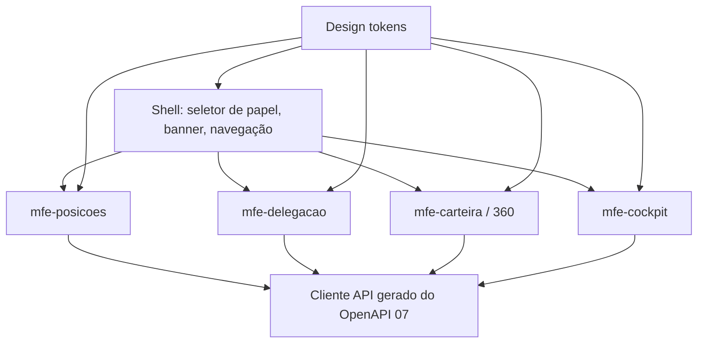

# 08 — Domínio: Experiência e Front-end (Micro-frontends) e Fluxo Executivo

> Princípios herdados de [../00-consolidacao.md](../00-consolidacao.md) §2. Requisitos: R5 (seletor de papel), R6, R8. Onda de entrega: **4**.
> O front é o meio de **validar jornadas com o gestor comercial**; o centro do projeto continua sendo dados/camada semântica.

## 1. Propósito e fronteiras
**Propósito:** apresentar as jornadas J1, J2 e J3 de forma clara a um gestor de negócio, com **shell** (navegação, seletor de papel, tema) e **micro-frontends por domínio**, consumindo apenas os contratos de 07.

**Dentro:** shell, seletor de papel (Posição 1–5 / Gerente Geral), micro-frontends, design tokens, estados de interface, acessibilidade, roteiro de demonstração (fluxo funcional executivo).
**Fora:** regra de negócio; identidade visual definitiva (**a definir pelo usuário em tempo de desenvolvimento** — o plano prevê *design tokens* substituíveis).
**Linguagem ubíqua:** Shell, MFE, Papel simulado, Banner de cobertura, Torre de Controle.

## 2. Specify

### 2.1 User stories
| ID | Pri. | História |
|---|---|---|
| US-UX-1 | P1 | Como apresentador, troco o papel no topo (Posição 1–5, Gerente Geral) e vejo a visão correspondente. |
| US-UX-2 | P1 | Como gestor de negócio, assisto ao fluxo de **turnover sem atrito** (J1). |
| US-UX-3 | P1 | Como gestor de negócio, vejo **cobertura de férias** com "Minha Carteira" e "Carteira Delegada" (J2). |
| US-UX-4 | P1 | Como GG, uso a **Torre de Controle** e simulo/execute redistribuição (J3). |
| US-UX-5 | P1 | Como gerente, abro a **visão 360°** do cliente e transfiro de posição. |
| US-UX-6 | P2 | Como apresentador, reinicio o cenário de dados com um clique (reset de seed). |

### 2.2 Requisitos funcionais
| ID | Requisito |
|---|---|
| FR-UX-001 | O **shell** hospeda o seletor de papel no topo e propaga o contexto de ator aos MFEs por contrato único (nunca por estado global compartilhado ad hoc). |
| FR-UX-002 | **Banner permanente "Modo simulação"** enquanto `SIMULACAO_PAPEL` ativo (FR-ACE-010). |
| FR-UX-003 | Um MFE por domínio: `mfe-posicoes` (01), `mfe-delegacao` (02), `mfe-carteira` (03, inclui 360° e redistribuição), `mfe-cockpit` (05). Cada MFE é implantável e testável isoladamente. |
| FR-UX-004 | Os MFEs comunicam-se apenas por **eventos customizados tipados** (ex.: `ator-alterado`, `cliente-selecionado`) e pelos contratos de 07. |
| FR-UX-005 | Visão do delegado: duas abas "Minha Carteira" / "Carteira Delegada" com etiqueta de **cobertura temporária** e data de término. |
| FR-UX-006 | Visão 360° do cliente em painel/modal: cadastro, risco, produtos (penetração), CRM, linha do tempo de posições; ação "Transferir de posição" com confirmação. |
| FR-UX-007 | Torre de Controle: KPIs (AUM, clientes, penetração), volumetria por segmento, **gráfico de capacidade** destacando posições fora dos limiares, e atalho para simular redistribuição. |
| FR-UX-008 | Redistribuição em duas etapas: **simular** (mostra antes/depois) → **confirmar**; resultado mostra o `id_lote` e permite desfazer. |
| FR-UX-009 | Estados explícitos em toda tela: carregando, vazio, erro (com ação de recuperação), sem permissão. |
| FR-UX-010 | Acessibilidade **WCAG 2.2 AA**: teclado, foco visível, contraste, rótulos, gráficos com alternativa textual/tabela. |
| FR-UX-011 | Formatação pt-BR (moeda BRL, datas dd/mm/aaaa, separadores). |
| FR-UX-012 | Identidade visual via **design tokens** (cor, tipografia, espaçamento, raio) em um único pacote; trocar a identidade não exige alterar MFEs. |
| FR-UX-013 | **Roteiro de demonstração** executável: J1 → J2 → J3 em ≤ 10 min, com dados do cenário correspondente e botão de reset. |
| FR-UX-014 | Nenhum dado é calculado no front (métricas vêm da camada semântica); front só formata e ordena. |

### 2.3 Fluxo funcional executivo (para o gestor de negócio)
Resumo em três quadros (detalhado no roteiro de demonstração):
1. **Operação cotidiana:** cada gerente vê só a sua mesa; o GG vê a agência inteira.
2. **Férias/afastamento:** delegação 01/11–15/11 → no 16º dia o acesso se encerra sozinho.
3. **Troca de gerente:** muda-se o nome na mesa; carteira, histórico e métricas permanecem.
Cada quadro tem: *cena* (o que o gestor vê), *mensagem de negócio* (uma frase), *prova na tela* (o que demonstra) e *dados do cenário*.

### 2.4 Cenários de aceite (E2E)
- **AC-UX-01 (J1)** — GG troca titular da POS-03 → ao alternar para POS-03, o novo nome aparece e os 70 clientes seguem iguais; histórico mostra os dois titulares.
- **AC-UX-02 (J2)** — selecionando POS-02 durante 01–15/11 → abas "Minha Carteira"/"Carteira Delegada" com etiqueta; ao avançar o relógio de demonstração para 16/11 → a aba some.
- **AC-UX-03 (J3)** — Torre mostra POS-01 em alerta (120%) e POS-04 (40%); simular movimento de 20 clientes mostra antes/depois; confirmar atualiza gráfico.
- **AC-UX-04** — troca de papel muda dados em ≤ 1 s, sem recarregar a página, sem vazar dados do papel anterior (teste de cache).
- **AC-UX-05** — navegação inteira por teclado; auditoria automática de acessibilidade sem violações críticas.
- **AC-UX-06** — erro de API → mensagem útil e ação "tentar novamente".
- **AC-UX-07** — reset do cenário restaura o hash do dataset (06).

### 2.5 Design system (decisão do usuário — normativo)
Os requisitos visuais deste domínio seguem **estritamente** [../system-design/DESIGN-stripe.md](../system-design/DESIGN-stripe.md), implementado sobre **shadcn/ui**, conforme [../system-design/01-design-system-shadcn-stripe.md](../system-design/01-design-system-shadcn-stripe.md). Isso **substitui o caráter genérico de FR-UX-012** por:
| ID | Requisito |
|---|---|
| FR-UX-015 | Cores, tipografia (peso, tracking, `ss01`, `tnum`), raios, espaçamento, elevação e densidade vêm **exclusivamente** dos tokens do DESIGN-stripe.md, gerados por script (não copiados à mão). |
| FR-UX-016 | Botões e tags são **pill**; um botão preenchido `primary` por região; `primary` nunca como cor de texto corrido. |
| FR-UX-017 | Células de dinheiro/contagem usam `tnum`; formatação pt-BR. |
| FR-UX-018 | Componentes base vêm de **shadcn/ui** em um pacote `ui` compartilhado por shell e MFEs; nenhum MFE duplica componente. |
| FR-UX-019 | Estados semânticos (crítico/atenção/informativo) só usam tokens já documentados, **sempre com ícone e texto** (NC-DS-4, decidido). |
| FR-UX-020 | Pares texto/fundo do tema atendem contraste ≥ 4,5:1 em texto pequeno; conflitos com o DESIGN são decididos por ADR (01-design-system §7). |
Cenários: **AC-UX-08** nenhuma cor/raio/peso fora dos tokens (varredura automática); **AC-UX-09** todos os botões renderizam pill com padding ≥ 8px 16px; **AC-UX-10** toda célula monetária tem `tnum`; **AC-UX-11** o relatório de contraste não contém par < 4,5:1 sem ADR.
Tarefas **T-DS-01…08** estão em 01-design-system §10 e substituem T-UX-01 e T-UX-11 como fonte de tokens e identidade. O gradiente em malha **não** é usado atrás de dados (NC-DS-2).

## 3. Clarify
> **Resolvidas** (ver [../perguntas-em-aberto.md](../perguntas-em-aberto.md)): NC-UX-4 → pt-BR, desktop primeiro, responsivo até tablet · NC-UX-5 → "viajar no tempo" só em modo simulação. **Segue aberta:** NC-UX-1 (composição de MFE; padrão: Module Federation, a confirmar no System Design).
1. `[NC-UX-1]` Tecnologia de MFE (Module Federation, Web Components, *single-spa*, iframe) e do shell → **System Design**.
2. ~~`[NC-UX-2]` Entrega da POC~~ — **Decidido:** app independente (React/TypeScript/Tailwind + shadcn/ui); Apps Script só como fonte de dados.
3. ~~`[NC-UX-3]` Identidade visual~~ — **Decidido:** DESIGN-stripe.md + shadcn/ui; NC-DS-1..8 todos fechados em 01-design-system §9.
4. `[NC-UX-4]` Idiomas e suporte a dispositivos móveis?
5. `[NC-UX-5]` Relógio de demonstração: permitir "viajar no tempo" para mostrar a expiração (afeta `Clock` — só em modo simulação)?

## 4. Plan
- **Arquitetura:** shell fino + MFEs por bounded context; **contrato de MFE** (props de entrada = ator/instante; eventos de saída tipados); biblioteca de **design tokens** e componentes base compartilhada (somente apresentação); cliente de API **gerado** a partir do OpenAPI de 07; **mock-first** com servidor de mocks derivado do contrato (permite desenvolver 08 em paralelo com 01–05).
- **Anti-slop de UI:** hierarquia visual intencional, sem componentes genéricos decorativos, textos reais (pt-BR de negócio, sem *lorem ipsum*), estados vazios úteis, gráficos com função clara (utilização vs. limiar, não decoração). Validar com a skill `impeccable` (crítica/polimento) e a diretriz de *frontend-design* da Anthropic.
- **Teste:** componentes (Testing Library), contratos (Pact consumidor), E2E das 3 jornadas (Playwright), acessibilidade automática (axe), regressão visual por captura.

### Quality attribute scenarios
| Atributo | Cenário | Medida |
|---|---|---|
| Independência | Alterar `mfe-cockpit` | Build/teste/deploy sem tocar nos demais |
| Acessibilidade | Auditoria axe + teclado | 0 violações críticas |
| Desempenho percebido | Troca de papel | ≤ 1 s |
| Marca | Trocar tokens | 0 alterações nos MFEs |

### Dependências do System Design
Tecnologia de MFE/shell, hospedagem, estratégia de autenticação no front.

## 5. Tasks
| # | Tarefa | Teste-primeiro | Par. |
|---|---|---|---|
| T-UX-01 | Tokens neutros + componentes base | Teste de tokens/contraste | [P] |
| T-UX-02 | Cliente de API gerado + servidor de mocks do contrato | Contrato × mock | [P] |
| T-UX-03 | Shell: seletor de papel, banner, propagação de ator | AC-UX-04 (sem vazamento entre papéis) | |
| T-UX-04 | `mfe-posicoes` (troca de titular, histórico) | AC-UX-01 | [P] |
| T-UX-05 | `mfe-delegacao` + abas de cobertura | AC-UX-02 | [P] |
| T-UX-06 | `mfe-carteira`: lista, 360°, transferência | Testes de componente + E2E | [P] |
| T-UX-07 | `mfe-cockpit`: KPIs, capacidade, simulação | AC-UX-03 | [P] |
| T-UX-08 | Estados (loading/vazio/erro/sem permissão) | AC-UX-06 | |
| T-UX-09 | Acessibilidade e teclado | AC-UX-05 | |
| T-UX-10 | Roteiro de demonstração J1→J2→J3 + reset | AC-UX-07 | |
| T-UX-11 | Aplicar identidade visual definida pelo usuário | Revisão visual/regressão | depende do usuário |

## 6. Checklist
- [ ] Nenhuma métrica calculada no front.
- [ ] Nenhuma regra de visibilidade no front (só exibe o que a API devolve).
- [ ] Banner de simulação presente em todos os fluxos simulados.
- [ ] Sem texto-placeholder ou componentes decorativos sem função.
- [ ] NC-UX-1..5 resolvidos/registrados no 00.
- [ ] Rastreável: R5→FR-UX-001/002; R6→003..007; R8→013, AC-UX-01..03.
