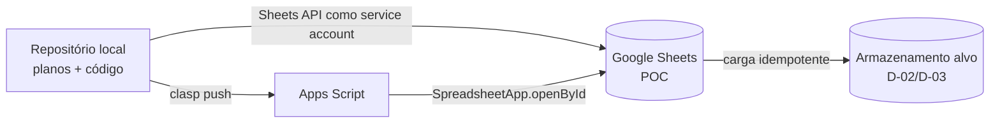

# Ambiente Google da POC — Sheets, Apps Script e Projeto GCP

> Registro do que foi **verificado** em 2026-10-01 sobre acesso e edição. Fonte dos links: [../../Infos.md](../../Infos.md). Nenhum dado de negócio foi criado ou alterado; só houve um teste de escrita reversível no Apps Script.

## 1. Recursos
| Recurso | Identificador | Observação |
|---|---|---|
| Planilha (Google Sheets) | `1ftzp2MniTBOxbn8IX6dYPpeZEZKPSc5AX5Q5zVw4W8g` | Dados da POC (aba `gid=0` na URL) |
| Projeto Apps Script (autônomo) | `1TwZ64-JQYJJqu8iw7OCp-fhnSIoxNEjZS1PS-TgvaQl1OX29TCuWC2iD` | Não está vinculado à planilha (é *standalone*): acessa a planilha por `SpreadsheetApp.openById` |
| Projeto GCP dedicado | `gestao-carteira-poc` | Criado nesta sessão; base do pipeline |
| Service account do pipeline | `carteira-pipeline@gestao-carteira-poc.iam.gserviceaccount.com` | Sem chave (política: usar *impersonation*) |

## 2. Resultado das verificações
| Capacidade | Estado | Evidência |
|---|---|---|
| **Ler** Apps Script via `clasp` (v3.3.0, já autenticado) | ✅ Comprovado | `clasp clone` trouxe `appsscript.json` e `Código.js` |
| **Escrever** Apps Script via `clasp push` | ✅ Comprovado | Adicionado comentário, `push`, novo `clone` mostrou o comentário; revertido e re-enviado (projeto voltou ao estado original) |
| **Ler/editar a planilha** com a conta `brunotrolo@gmail.com` do `gcloud` | ❌ Não | Drive e Sheets API devolveram 403 (token do `gcloud` sem escopo de Drive/Sheets e/ou API desabilitada no projeto ativo) |
| **Ler/editar a planilha** via conector Drive do assistente | ❌ Não | Conector exige autorização OAuth interativa que esta sessão não consegue concluir |
| **Ler/editar a planilha** via service account (*impersonation*, sem chave) | ✅ Comprovado | Após o compartilhamento (ENV-1) e a propagação do IAM: leitura do título "Gestão de Carteira Bancária" e da aba `Página1` (1000×26); criada a aba `_teste_claude`, escrito e relido `A1`, aba removida — planilha voltou a ter só `Página1` |

## 3. Estado atual do projeto Apps Script (importante)
- Contém só o modelo (`function myFunction() {}`).
- **Manifesto:** fuso `America/Sao_Paulo`, runtime V8, `exceptionLogging: STACKDRIVER` e **web app** com `executeAs: USER_DEPLOYING` e `access: ANYONE_ANONYMOUS`.
- ⚠️ **Risco:** com acesso anônimo, qualquer pessoa com a URL de implantação executaria o código **com as permissões do dono**. Ao implantar, trocar para acesso restrito (ex.: `MYSELF` ou domínio) — ou não implantar web app nesta fase. O front será um app independente (D-15); o Apps Script só precisa servir dados se a POC o exigir.

## 4. O que falta (ação sua + reteste meu)
1. **Compartilhar a planilha como Editor** com `carteira-pipeline@gestao-carteira-poc.iam.gserviceaccount.com`.
2. Reteste: impersonação → leitura de título e abas → escrita controlada em uma aba de teste (criada e removida).
3. (Opcional) Vincular o projeto Apps Script ao projeto GCP `gestao-carteira-poc` (Configurações do projeto → Projeto do Google Cloud) caso a POC precise de APIs/quotas próprias.
4. (Opcional) Orçamento/billing **não** é necessário para Sheets/Drive/Apps Script API; só será para Cloud Run/BigQuery/Cloud SQL (decisões D-02/D-03/D-08).

## 5. Papel no pipeline (planejamento — nada implementado)

- **Código do Apps Script** versionado no repositório e publicado por `clasp` (revisável, testável).
- **Dados sintéticos** (domínio 06) carregados na planilha por Sheets API com a service account — carga idempotente e reproduzível (FR-DAD-010).
- **Credenciais:** sem chave de service account em disco; uso por *impersonation* a partir do usuário autenticado no `gcloud`; nada de segredos no repositório.
- **Alinhamento com a constituição:** a planilha é adaptador de armazenamento da POC (porta de repositório do 06), não fonte de regra de negócio.

## 6. Decisões e pendências
| ID | Item | Estado |
|---|---|---|
| ENV-1 | Compartilhar a planilha com a service account (Editor) | ✅ Feito pelo usuário |
| ENV-2 | Retestar impersonação e escrita na planilha | ✅ Feito (§2) |
| ENV-3 | Web app do Apps Script | ✅ **Decidido:** permanece **apenas em modo de desenvolvimento (sem implantação)**; o usuário publica manualmente quando precisar. O assistente **não implanta**. O manifesto ainda traz `ANYONE_ANONYMOUS`; ao publicar, rever esse acesso (§3) |
| ENV-4 | Vincular Apps Script ao projeto GCP `gestao-carteira-poc` | Opcional; só se a POC exigir APIs/quotas próprias |

**Aba atual da planilha:** `Página1` (vazia na verificação de estrutura). O desenho das abas da POC virá do domínio 06 (dicionário de dados), não foi alterado.
