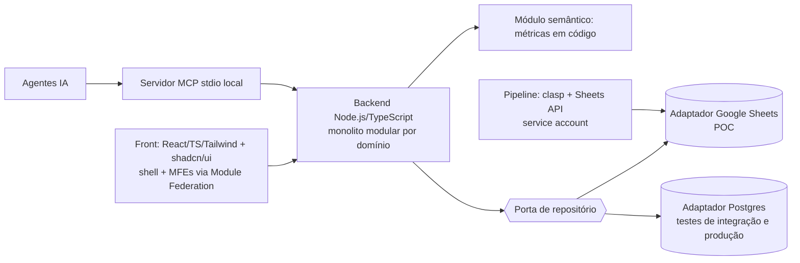

# Decisões de System Design da POC (D-01 … D-14)

> **Status:** decididas em 2026-10-01 pelo usuário ("adotar as recomendações", por ser uma POC). Formato de ADR resumido. **Revisáveis**: se chegar um `.md` de System Design com outra orientação, cada decisão é reavaliada (ver [99](99-system-design-pendente.md) §1). Nada foi implementado.
> Atributos de qualidade que orientam a escolha: **simplicidade e reversibilidade** (POC), **auditabilidade**, **testabilidade**, **portabilidade Sheets → SQL** (domínio 06), **segurança de dados sensíveis** (CPF/CNPJ mascarados).

## Visão resultante

## Registro
| ID | Decisão | Justificativa | Consequências e riscos | Verificação |
|---|---|---|---|---|
| **D-01** | **Monolito modular**: um deployável, módulos = bounded contexts 01–05, sem acesso cruzado a tabelas; comunicação por portas/eventos internos | Menor custo para POC; preserva a opção de extrair serviços (alvo do usuário) | Disciplina de fronteira exige teste automatizado | Teste de arquitetura: módulo X não importa internals de Y |
| **D-02** | **Persistência:** porta de repositório com dois adaptadores — **Google Sheets** (POC) e **Postgres** (testes de integração e produção, Cloud SQL) | Sheets é o ambiente da POC; Postgres dá ACID e constraints reais para provar as invariantes | **Sheets não tem transação**: atomicidade de lote na aplicação com validação prévia (risco já listado em 00 §13); suíte de contrato de repositório roda nos dois | Mesma suíte verde nos dois adaptadores (T-POS-06) |
| **D-03** | **Analítico/read models:** na POC, calculados pela aplicação sobre o adaptador; em produção, views/read models em Postgres e, se o volume exigir, BigQuery | Dados sintéticos pequenos (≈ 350 clientes) | BigQuery só quando houver necessidade e billing | Testes de valor esperado das métricas (05) |
| **D-04** | **Autorização:** núcleo próprio puro (`decidir`) + adaptador SQL de predicado de linha; **spike** de OpenFGA depois, sem bloquear | Regra simples e totalmente testável; porta permite trocar | OpenFGA/Permify só se a complexidade crescer; Permify tem AGPL-3.0 | Property-based + equivalência núcleo×SQL (04) |
| **D-05** | **Autenticação:** **papel simulado** (seletor) com *feature flag* na POC; Google Identity/IdM em produção | Decisão do usuário: sem IdM na POC | Flag proibida em produção (teste de configuração) | AC-ACE-09 |
| **D-06** | **Camada semântica:** modelo de métricas versionado **em código TypeScript** na POC; spike do **Cube** sobre Postgres como evolução; fallback = views SQL versionadas | Evita novo componente na POC; métricas definidas num único lugar (C6) | Cube só se o spike validar segurança por linha e fonte | Testes de valor esperado; ADR do spike |
| **D-07** | **Backend em Node.js + TypeScript** | Mesma linguagem do front (React/TS); tipos compartilhados dos contratos | Python/FastAPI descartado na POC | Tipos gerados do OpenAPI |
| **D-08** | **Hospedagem:** execução **local** na POC; **Google Cloud Run** (projeto `gestao-carteira-poc`) quando for publicar | Cloud Run foi o alvo citado no Plano Geral | Cloud Run exige **billing** no projeto (não habilitado) — decisão do usuário no momento da publicação | Checklist de deploy (D-14) |
| **D-09** | **Eventos:** barramento **interno em memória** com padrão **outbox** (tabela/aba de eventos) para idempotência; broker externo só em produção | Eventos de domínio já previstos (01–03) sem infraestrutura | Outbox na aba do Sheets é "melhor esforço" (sem transação) | Teste de publicação única por troca (T-POS-07) |
| **D-10** | **MFE:** shell + micro-frontends em **React** com **Module Federation**; pacote `ui` compartilhado (shadcn/ui + tokens) | Alinha com D-15 e com o alvo de um MFE por domínio | Complexidade de build; singleton de React no shell | E2E das jornadas (AC-UX-01..03) |
| **D-11** | **MCP:** servidor local (**stdio**) na POC; remoto com autenticação só em produção | Seguro por padrão; sem superfície de rede | Escrita via MCP só cria delegação *Submetida* (Q-37) | AC-API-04..06 |
| **D-12** | **Monorepo** com *workspaces*: `domain/*`, `adapters/*`, `contracts/`, `frontend/*` (shell, MFEs, `ui`), `data/`, `apps-script/`, `planos/` | Um repositório facilita contratos e refatoração entre domínios | Precisa de regras de fronteira por pasta (D-01) | Lint de dependências entre pacotes |
| **D-13** | **Observabilidade:** logs JSON estruturados com `correlation_id` (API → domínio → auditoria); sem PII (CPF/CNPJ nunca em claro); métricas/traços depois (OpenTelemetry), Cloud Logging no Cloud Run | Rastreabilidade e privacidade com custo mínimo | Logs de auditoria **sem expurgo** (Q-25) | Teste: padrão de CPF/CNPJ ausente de logs |
| **D-14** | **CI/CD:** repositório **git** (hoje a pasta **não** é um repositório) + **GitHub Actions** com os gates do 00 §7/§9; `clasp` para publicar o Apps Script; deploy no Cloud Run quando D-08 for acionado | Gates automáticos (testes, tipos, lint, mutação, varreduras de design) | **Criar o repositório remoto e publicar código é ação sua/confirmada antes**; sem segredos no repositório | Pipeline vermelho→verde em exemplo (onda 0) |

## Efeitos nos planos
- **00 §5:** a onda 0 passa a incluir: `git init` local, esqueleto do monorepo (D-12) e CI (D-14) — **após** sua liberação de desenvolvimento.
- **06:** matriz de portabilidade e carga idempotente ganham o adaptador Sheets via Sheets API com a service account (02-ambiente).
- **07/08:** tipos TypeScript gerados do OpenAPI; cliente de API do front gerado do mesmo contrato.
- **04/05:** núcleo e módulo semântico em TypeScript, sem dependência de I/O.

## Repositório (informado em 2026-10-01)
- Remoto: https://github.com/brunotrolo/GestaoCarteiraBancaria — branch padrão `main`, contém só `README.md` ("Initial commit"), **visibilidade pública**, permissão do usuário: ADMIN; `gh` autenticado com escopos `repo` e `workflow`.
- **Cuidados antes do primeiro envio (repositório público):**
  1. **Não publicar** `Infos.md` (IDs/URLs da planilha e do Apps Script) nem qualquer credencial; incluir no `.gitignore` e, se preferir, manter o repositório privado.
  2. `.clasp.json` contém o `scriptId`: tratar como configuração local (fora do repositório) ou aceitar a exposição conscientemente.
  3. `Plano Geral.md` é transcrição de conversa interna do banco: confirmar se pode ser público (o usuário decide; os planos em `planos/` não contêm dados reais).
  4. Dados sintéticos apenas; nenhum dado real, chave de service account ou token.
- **Atualização 2026-10-01:** repositório agora **privado**; usuário autorizou publicar todos os docs e determinou **nunca criar branch — sempre commit/deploy direto na `main`**. Isso substitui o fluxo anterior de branch de trabalho/PRs: commits pequenos e frequentes na `main`, protegidos pelos gates locais/CI (00 §7/§9). Consequência: sem revisão por PR, o *Reviewer independente* (00 §6) revisa antes do push e o CI roda após cada push na `main` (gate pós-fato; falha deve ser corrigida no commit seguinte).
- `.gitignore` criado (exclui `.sf/`, credenciais, `node_modules` etc.).

## Pontos que ainda dependem do usuário (não são decisões de arquitetura)
1. **Billing** do projeto GCP, só quando decidir publicar no Cloud Run.
2. ~~Criação do repositório remoto~~ — **existe**; falta autorizar `git init`/*push* e decidir **público × privado** (ver cuidados acima).
3. **Liberação para iniciar o desenvolvimento** (hoje: "não desenvolva nada ainda").
